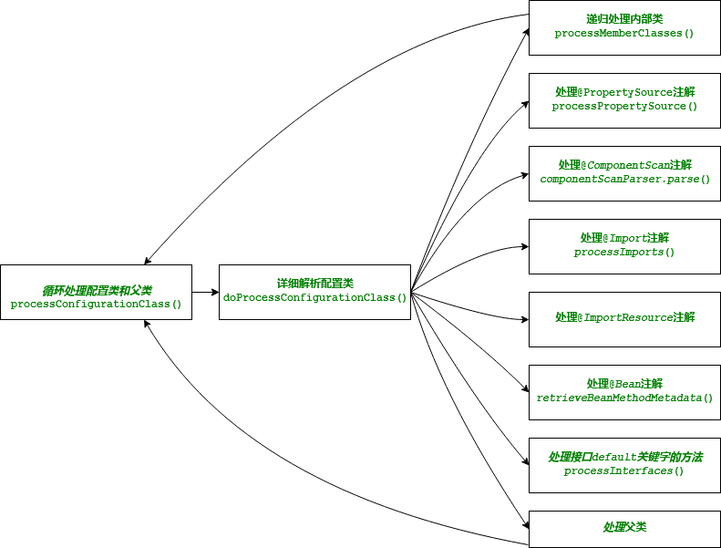
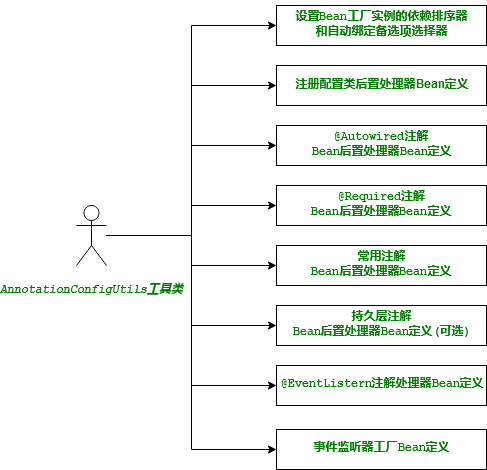

# Spring 高级容器原理 - 深入源码


## 前述

在**java**技术栈中, 大多**java**开发者、公司都会用到**Spring**提供的技术能力. **Spring**官方开发了很多的项目, 如**Spring Framework**、**Spring Boot**、**Spring Cloud**、**Spring Session**.
其中**IOC**容器是**Spring**的核心技术支持, **Spring**内部绝大多数项目都依赖该项技术. 在我参与开发的很多项目中, 几乎都离不开**Spring IOC**容器这一基础技术. 使用**Spring IOC**容器中, 在所难免会遇到一些疑问, 时常会出现抛出找不到属性依赖的对象异常, 刚开始遇到这样问题很多时候都是在网上搜索查找解决方案. 然而, 查找有效信息是件很费经的事, 且经常会遇到重复的问题, 又因过分依赖网上搜索引擎、对框架本身深不可测, 且对问题的解决方法大多是拿来主义而没有形成固有经验, 如是重复这样的过程, 就会导致为了解决一个问题花费太多的搜索时间. 这也是我理解的新手和经验老手之间的距离. 经验老手可以在遇到问题时快速的定位问题并找到解决方法, 而新手对于一个很浅显的异常都有可能不知所措, 不断网上搜索, 在技术群问.

俗话说, "磨刀不误砍柴工", 对一项技术工具了解越多, 掌握的越深, 在项目开发中越得心应手, 遇到问题总会快速、有效的定位并解决. 本文从**Spring IOC**容器为入口, 深入源码原理, 帮助你在遇到**Spring IOC**异常如何更快定位问题并解决它, 挖掘在项目中如何更好的应用. 掌握**Spring IOC**原理, 对理解并应用其他相关的支持组件都有很大的帮助, 所以建议读者深刻理解并掌握**Spring IOC**原理.


## 容器

#### 一、 容器概览

以一张图来看看, **Spring IOC**容器包含哪些东西  


* `ResourdeLoader` 资源文件加载器, 定义了文件资源加载方式, 如系统文件、类文件、网络文件. 在**java**中, 这些都是由不同的方式进行加载, 如:`File`系统文件由`FileInputStream`文件输入流来加载、 `Class`文件由`ClassLoader`类加载器加载, 网络文件由`URL`建立连接并获取`InputStream`输入流. 而**Spring** 使用`Resource`接口对这些不同形式的文件进行了抽象描述, 统一返回`InputStream`输入流.

* `StandardEnvironment`定义了容器所有的环境变量, 抽象接口是`Environment`. 
  1. 系统环境变量, 这个是在操作系统上配置的环境变量, 如: **PATH  JAVA_HOME**
  2. **JVM**系统属性, 是**java**虚拟机运行相关的环境变量, 运行应用时可以指定`-DpropertyName=propertyValue`这种以`-D`选项开头的方式指定参数变量
  3. 应用自定义配置文件, 如`application.properties` 
  Spring使用`PropertySource`抽象封装了键值对这样的可配置属性数据源, **Spring**极大扩展和方便变量的配置工作

* `DefaultListableBeanFacotry` 管理`Bean`实例获取、创建、初始化、依赖注入和缓存单例`Bean`, 是真正意义上的`Bean`实例容器.

* `BeanDefinitionRegistryPostProcessor` **`Bean`定义注册器后置处理器**, 是容器对外输出如何发现、读取、解析、创建**`Bean`定义**并注册**`Bean`定义声明**

* `BeanFactoryPostProcessor` **`Bean`工厂后置处理器**, 是容器对外输出能够对**`Bean`工厂**执行增强、配置, 如编码方式向容器添加`Bean`实例, 替换**`Bean`定义声明**元数据中的字符串占位符为具体值

* `BeanPostProcessor` **`Bean`后置处理器**, 是容器对外输出预测类型、确定构造函数、对实例前/后置处理、属性值设置、初始化前/后置处理等控制创建`Bean`实例一系列过程, 这是容器对外输出参与`Bean`实例创建最详细的生命周期能力

* `MessageSource` 国际化消息组件, 容器默认的组件实例是`DelegatingMessageSource`

* `ApplicationEventMulticaster` 轻量级事件广播器, 是容器提供的事件监听机制, 在容器初始化完成后会广播一个`ContextRefreshedEvent`事件, 我们可以监听这个事件. 适合一些其他需要容器初始化完成后才开始执行的动作, 如**Spring**自带的定时任务, 就是监听到这个事件后触发定时任务初始化工作

* `LifecycleProcessor` `Bean`实例生命周期处理器, 是容器初始化完成, 所有`Bean`实例一切就绪后, 容器对外输出实现`Lifecycle`接口的扩展组件`Bean`执行自动启动, 如`rabbitmq`客户端组件就是应用了这个机制. 当容器初始化完成后, 容器引导`rabbitmq`启动, `rabbitmq`客户端组件内部开始执行`rabbitmq`客户端连接到`rabbitmq`服务器, 创建监听器监听队列消息等一系列初始化工作. 


#### 二、 如何创建一个新容器

**Spring**容器被设计为父子层级容器, 子容器可以继承公共父容器的**Bean**实例, 这对于某些场景需要多个不同隔离的子容器提供了支持. 比如在**Spring MVC**中, 展现层`Bean`位于一个子容器中, 而业务层和持久层的`Bean`位于父容器中. 这样, 展现层`Bean`就可以引用业务层和持久层的`Bean`, 而业务层和持久层的`Bean`则看不到展现层的`Bean`.
创建**Spring**容器可以以XML文件声明式和注解编码两种方式, 或者混用两种方式. 针对不同方式, **Spring**提供不同的支持类:
* XML声明方式: `ClassPathXmlApplicationContext` `FileSystemXmlApplicationContext`
* 注解编码方式: `AnnotationConfigApplicationContext`
这里提到的两种方式的支持类是框架内部基本的两个创建容器的类, 针对**Spring MVC**、**Spring Boot**都会有自己的实现类. 本文统一使用`AnnotationConfigApplicationContext`这种注解方式进行讲解.

首先介绍一下本文用到的maven项目结构, 如下
>```
>troubleshoot
>  src
>    main
>      java
>        com.rutine.troubleshoot.container
>          SpringContainer.java
>        com.rutine.troubleshoot.container.bean
>          BeanA.java
>          BeanB.java
>        com.rutine.troubleshoot.container.config
>          ContextConfig.java
>      resources
>         logback.xml
>    test
>      java
>      resources
>  pom.xml
>```
这是一个标准的**maven**项目结构, **java**目录都是存放**java**包、**java**文件的根目录, **resources**目录存放应用、日志、国际化消息及其他配置相关的配置文件.


注解方式创建容器的几种实例

1. 注解类为参数的构造器  
* 注解类
```java
//该注解很重要
@Configuration
public class ContextConfig {
  //配置类主入口
}
```
`ContextConfig`注解类很简单, 里面什么也没有, 类应该是被`@Configuration`、`@Component`、`@Inject`注解所标记. 如果需要在注解类声明`Bean`定义, 应该在`@Configuration`注解的类里面写一个方法, 此方法必须存在返回值, 且返回类型是`Bean`的类型, 并在方法上添加`@Bean`注解.

* 注解类为参的构造器
```java
public class SpringContainer {
  public static void main(String[] args) {
    AnnotationConfigApplicationContext context = new AnnotationConfigApplicationContext(ContextConfig.class);
    context.start();
  }
}
```

2. 包名为参数的构造器  
```java
public class SpringContainer {
  public static void main(String[] args) {
    AnnotationConfigApplicationContext context = new AnnotationConfigApplicationContext("com.rutine.troubleshoot.container");
    context.start();
  }
}
```
以包名为参创建容器, 在容器初始化过程中, 会扫描包名及子包名下所有`@Configuration`注解的类并注册为`Bean`定义, 且会解析注解类中`@Bean`注解的方法并注册为`Bean`定义

3. 无参的构造器  
```java
public class SpringContainer {
  public static void main(String[] args) {
    AnnotationConfigApplicationContext context = new AnnotationConfigApplicationContext();
    context.register(ContextConfig.class);
    // context.scan("com.rutine.troubleshoot.container");
    context.refresh();
    context.start();
  }
}
```
以无参构造器方式创建一个完整的容器, 需要的代码也不多, 调用`register`方法注册一个注解类或者调用`scan`方法指定要扫描的包名, 然后调用`refresh`方法刷新容器, 调用刷新方法是**必须的**, 容器初始化大量相关的工作需要调用该方法.


#### 三、 容器启动流程

通过前面的示例, 创建一个容器很简单, 仅两三行代码就完成了. 我们输入一个配置类或者包名, 最后容器输出一系列事先定义的`Bean`实例(仅限单例会预先创建, 多例要在运行时动态创建), 容器里面到底发生了什么, 我们不知晓, 一般来说也不需要关心, 容器自身保证输出的`Bean`实例及依赖关系的正确性. 让我们窥视下这个黑盒子做了哪些工作:  


1. 容器实例引擎由调用`AnnotationConfigApplicationContext`的构造函数创建
2. 容器内部创建`DefaultListableBeanFactory` 默认的`Bean`工厂实例, `Bean`工厂实例管理着`Bean`实例对象的获取、类型加载、最优构造器/工厂方法选择、创建实例、属性依赖绑定、后置处理器调用(如返回AOP生成的代理对象, 动态修改属性依赖绑定)、初始化、初始化回调(如通知`aware`接口实现)并注册缓存单例`Bean`
3. `Bean`定义读析器实例由容器调用`AnnotatedBeanDefinitionReader`的构造函数创建, 并接受`BeanDefinitionRegistry`类型的`Bean`定义注册器实例作为参数, 容器自身实现了该接口, 所以这里传入的是容器实例
4. `Bean`定义读析器尝试从容器获取`Environment`环境变量实例, 如果容器不能获取到环境变量实例, 则会创建新的`StandardEnvironment`环境变量实例
5. `Bean`定义读析器内部创建`ConditionEvaluator`状态求值器实例, 该实例用于计算读析器判断一个`Bean`定义声明是否可被注册, 这项技术在**Spring Boot**中大量使用, 我们按需添加**jar**包依赖, **Spring Boot**自动发现并配置容器功能的原型就是引用这项技术, **Spring Boot**扩展并增强了这项技术的应用
6. 设置`Bean`工厂的注解排序器为`AnnotationAwareOrderComparator`实例, 在同类`Bean`中, 排序器根据注解`@Order`属性值或者实现`Ordered`接口唯一方法返回值, 决定其排序位置, 整型值越小排序越靠前, 优先级越高. 如容器对多个`BeanPostProcessor`实现类执行后置处理时, 根据其排序进行顺序后置处理
7. 设置`Bean`工厂的自动绑定备选项选择器为`ContextAnnotationAutowireCandidateResolver`实例, 对于一个有资格被绑定到依赖属性的`Bean`, 称这样的`Bean`为"种子`Bean`", 而最终能够被选中并绑定到属性依赖的`Bean`称之为"资格`Bean`", 在实际场景中, 我们可能会对某些`Bean`进行代理增强, `Bean`工厂在查找属性依赖注入的时候希望注入的是经过增强后的代理实例而不是原始`Bean`实例. 容器的做法就是通过一个标志位来区分是否可作为属性依赖注入的"种子`Bean`"
8. 注册配置类后置处理器`ConfigurationClassPostProcessor`的`Bean`定义, 因为是`Bean`定义声明, 只有在容器刷新时, 才会创建配置类后置处理器实例对象. 由于该`Bean`定义声明实现了`BeanDefinitionRegistryPostProcessor`和`PriorityOrdered`接口, 因此在所有`Bean`定义声明中最优先被创建实例对象, 在容器启动中, 该`Bean`实例对象解析`@Configuration`注解的`class`文件(称为: 配置类). 配置类是编码方式声明其他`Bean`定义的入口
9. 包路径`Bean`定义扫描器实例由容器调用`ClassPathBeanDefinitionScanner`的构造函数创建, 包路径`Bean`定义扫描器根据指定的包名扫描该包下被`@Component`或元注解是`@Component`所注解的`class`, 并解析注册为`Bean`定义声明, 元注解是`@Component`的注解有: `@Service` `@Repository` `@Controller` `@Configuration`. 同时支持**java**平台自身的`javax.annotation.ManagedBean` `javax.inject.Named`. 以及可以向包路径`Bean`定义扫描器注册我们的"自定义注解"
10. 最后一步是刷新容器实例引擎, 刷新容器的方法在容器的父类`AbstractApplicationContext`中, 该方法抽象了刷新容器绝大多数细节, 容器初始化大量工作正式由这里开始并一直到准备就绪完毕

总结一下, 前面介绍了在容器实例引擎启动流程中涉及到几个比较重要的类, 每个类承担着不同却异常重要的角色, 每个类都是独立的但又相互联系, 若即若离组成了一个设计良好、完整的容器所必须的功能. 这些类实例都是为容器开始初始化做足前期准备, 容器正式启动并完成初始化是调用`refresh`方法.

## 深入源码与原理

从本小节开始, 将会以`AnnotationConfigApplicationContext`为起点深入每行代码的讲解, 应该说不是真正的做到每一行代码, 而是把绝大多数、有意义、影响到全文理解的都会进行讲解分析. 后面会看到大量的`copy`源码. 在这里, 而没有建议读者直接回到专业的编辑工具去查阅源码. 目的就是为了减少来回切换, 影响阅读连贯性, 增强可读性, 更好的理解和更容易的掌握. 在源码讲解过程中, 对有些代码类会增加一些场景使用代码来进一步说明. 理解是缘由, 场景实战才是目的. 

`AnnotationConfigApplicationContext` 无参构造器源码
```java
public class AnnotationConfigApplicationContext {
   public AnnotationConfigApplicationContext() {
    this.reader = new AnnotatedBeanDefinitionReader(this);
    this.scanner = new ClassPathBeanDefinitionScanner(this);
  }
  
  //省略其他源码....
}
```
构造器内创建两个对象实例, 一个是注解`Bean`定义读析器, 一个是类路径`Bean`定义扫描器. 读析器通过指定一个`@Configuration`类型的注解类为入口, 扫描器是扫描路径下的注解类型为`@Component`的类并解析为`Bean`定义.

`AnnotatedBeanDefinitionReader` 注解`Bean`定义读析器两个构造器源码
```java
public class AnnotatedBeanDefinitionReader {
  public AnnotatedBeanDefinitionReader(BeanDefinitionRegistry registry) {
    this(registry, getOrCreateEnvironment(registry));
  }
  
  public AnnotatedBeanDefinitionReader(BeanDefinitionRegistry registry, Environment environment) {
    this.registry = registry;
    this.conditionEvaluator = new ConditionEvaluator(registry, environment, null);
    AnnotationConfigUtils.registerAnnotationConfigProcessors(this.registry);
  }
  
  //省略其他源码....
}
```
最终是调用两个参数的构造器, 第一个参数是`Bean`定义注册器, 第二个是环境实例, 内部创建一个状态求值器实例, 最后调用工具类注册一些默认的处理器`Bean`定义

`AnnotationConfigUtils.registerAnnotationConfigProcessors`方法源码:
```java
public class AnnotationConfigUtils {
  public static Set<BeanDefinitionHolder> registerAnnotationConfigProcessors(BeanDefinitionRegistry registry, Object source) {
    // 1. 尝试解包Bean工厂实例, 设置依赖排序器和自动绑定备选项选择器
    DefaultListableBeanFactory beanFactory = unwrapDefaultListableBeanFactory(registry);
    if (beanFactory != null) {
      if (!(beanFactory.getDependencyComparator() instanceof AnnotationAwareOrderComparator)) {
        beanFactory.setDependencyComparator(AnnotationAwareOrderComparator.INSTANCE);
      }
      if (!(beanFactory.getAutowireCandidateResolver() instanceof ContextAnnotationAutowireCandidateResolver)) {
        beanFactory.setAutowireCandidateResolver(new ContextAnnotationAutowireCandidateResolver());
      }
    }
    
    // 内部预定义的后置处理器, 按照注册顺序, 在容器内前面的先于后面的执行
    Set<BeanDefinitionHolder> beanDefs = new LinkedHashSet<BeanDefinitionHolder>(4);

    // 2. 注册配置类后置处理器Bean定义, 处理@Configuration注解的类, 扫描类中的Bean定义. 在声明Bean定义阶段
    if (!registry.containsBeanDefinition(CONFIGURATION_ANNOTATION_PROCESSOR_BEAN_NAME)) {
      RootBeanDefinition def = new RootBeanDefinition(ConfigurationClassPostProcessor.class);
      def.setSource(source);
      beanDefs.add(registerPostProcessor(registry, def, CONFIGURATION_ANNOTATION_PROCESSOR_BEAN_NAME));
    }

    // 3. 注册属性/方法依赖注入后置处理器Bean定义, 处理@Autowired注解. 在创建Bean实例解决依赖注入阶段
    if (!registry.containsBeanDefinition(AUTOWIRED_ANNOTATION_PROCESSOR_BEAN_NAME)) {
      RootBeanDefinition def = new RootBeanDefinition(AutowiredAnnotationBeanPostProcessor.class);
      def.setSource(source);
      beanDefs.add(registerPostProcessor(registry, def, AUTOWIRED_ANNOTATION_PROCESSOR_BEAN_NAME));
    }

    // 4. 注册属性/方法依赖注入校验后置处理器Bean定义, 处理@Required注解. 在创建Bean实例解决依赖注入阶段, 校验是否必须满足
    if (!registry.containsBeanDefinition(REQUIRED_ANNOTATION_PROCESSOR_BEAN_NAME)) {
      RootBeanDefinition def = new RootBeanDefinition(RequiredAnnotationBeanPostProcessor.class);
      def.setSource(source);
      beanDefs.add(registerPostProcessor(registry, def, REQUIRED_ANNOTATION_PROCESSOR_BEAN_NAME));
    }

    /**
     * 5. 注册属性/方法级别@Resource @PostConstruct @PreDestroy这些公共注解后置处理器Bean定义, 这些都是java规范定义的注解
     */ 
    // 检查是否支持JSR-250, 如果支持则添加 CommonAnnotationBeanPostProcessor 处理器
    if (jsr250Present && !registry.containsBeanDefinition(COMMON_ANNOTATION_PROCESSOR_BEAN_NAME)) {
      RootBeanDefinition def = new RootBeanDefinition(CommonAnnotationBeanPostProcessor.class);
      def.setSource(source);
      beanDefs.add(registerPostProcessor(registry, def, COMMON_ANNOTATION_PROCESSOR_BEAN_NAME));
    }

    // 6. 注册处理JPA持久层级相关的注解后置处理器Bean定义
    // 检查是否支持JPA持久层, 如果支持则添加 PersistenceAnnotationBeanPostProcessor 处理器
    if (jpaPresent && !registry.containsBeanDefinition(PERSISTENCE_ANNOTATION_PROCESSOR_BEAN_NAME)) {
      RootBeanDefinition def = new RootBeanDefinition();
      try {
        def.setBeanClass(ClassUtils.forName(PERSISTENCE_ANNOTATION_PROCESSOR_CLASS_NAME, AnnotationConfigUtils.class.getClassLoader()));
      }
      catch (ClassNotFoundException ex) {
        throw new IllegalStateException("Cannot load optional framework class: " + PERSISTENCE_ANNOTATION_PROCESSOR_CLASS_NAME, ex);
      }
      def.setSource(source);
      beanDefs.add(registerPostProcessor(registry, def, PERSISTENCE_ANNOTATION_PROCESSOR_BEAN_NAME));
    }

    // 7. 注册处理@EventListener注解的处理器Bean定义, 在Bean实例初始化完成后用于检查该Bean实例是否存在监听器定义
    if (!registry.containsBeanDefinition(EVENT_LISTENER_PROCESSOR_BEAN_NAME)) {
      RootBeanDefinition def = new RootBeanDefinition(EventListenerMethodProcessor.class);
      def.setSource(source);
      beanDefs.add(registerPostProcessor(registry, def, EVENT_LISTENER_PROCESSOR_BEAN_NAME));
    }
     // 8. 注册事件监听器工厂Bean定义, 对@EventListener注解的方法创建监听器
    if (!registry.containsBeanDefinition(EVENT_LISTENER_FACTORY_BEAN_NAME)) {
      RootBeanDefinition def = new RootBeanDefinition(DefaultEventListenerFactory.class);
      def.setSource(source);
      beanDefs.add(registerPostProcessor(registry, def, EVENT_LISTENER_FACTORY_BEAN_NAME));
    }

    return beanDefs;
  }
  //省略其他源码....
}
```

该工具方法完成一些重要的处理器`Bean`定义注册, 对于在这里注册的`Bean`实例和`Bean`定义可以从三种类型理解:
1. 第一是准备工厂环境, 先解包获取默认的`Bean`工厂实例, 然后设置依赖排序器和依赖选择器, 这都是直接实例对象, 目的配置好工厂环境
2. 第二是参与容器生命周期的处理器`Bean`定义, 该类型的`Bean`定义实例是由容器先于`Bean`定义实例创建, 而配置类后处理器属于该类型. 该处理器主要用于加载已注册`Bean`定义的目标类, 解析`Bean`定义目标类是否存在新的`Bean`定义, 如有则注册为新的`Bean`定义声明. 这个阶段完成根据已有的`Bean`定义发现并注册新的`Bean`定义
3. 第三是参与`Bean`实例创建生命周期的处理器`Bean`定义, 该类型的处理器`Bean`定义实例先于其他`Bean`定义实例创建, 但晚于容器生命周期处理器类型实例. 在创建`Bean`实例和初始化过程被触发调用, 解决依赖属性、校验依赖是否满足、包装方法(事件监听器)


## `AnnotationAwareOrderComparator` 源码分析

该类在容器中有两大用处, 第一用处在容器内部调用PostProcessor处理器时, 优先触发调用实现了接口`Ordered`或注解`@Order`的处理器, 值越小越优先被触发. 第二用处在属性依赖选择时, 当属性依赖只需一个种子`Bean`, 而容器发现存在多个种子`Bean`, 根据`@Priority`注解, 值小者被选择性更高, 存在优先级一样等不确定时容器会抛出异常
```java
public class AnnotationAwareOrderComparator {
  //用于调用顺序
  protected Integer findOrder(Object obj) {
    // 1. 检查 Ordered 接口
    Integer order = super.findOrder(obj);
    if (order != null) {
      return order;
    }

    // 2. 检查 @Order 注解
    if (obj instanceof Class) {
      return OrderUtils.getOrder((Class<?>) obj);
    }
    else if (obj instanceof Method) {
      Order ann = AnnotationUtils.findAnnotation((Method) obj, Order.class);
      if (ann != null) {
        return ann.value();
      }
    }
    else if (obj instanceof AnnotatedElement) {
      Order ann = AnnotationUtils.getAnnotation((AnnotatedElement) obj, Order.class);
      if (ann != null) {
        return ann.value();
      }
    }
    else if (obj != null) {
      order = OrderUtils.getOrder(obj.getClass());
      if (order == null && obj instanceof DecoratingProxy) {
        order = OrderUtils.getOrder(((DecoratingProxy) obj).getDecoratedClass());
      }
    }

    return order;
  }
  
  //用于依赖选择
  public Integer getPriority(Object obj) {
    Integer priority = null;
    if (obj instanceof Class) {
      // 查找javax.annotation.Priority注解
      priority = OrderUtils.getPriority((Class<?>) obj);
    }
    else if (obj != null) {
      priority = OrderUtils.getPriority(obj.getClass());
      if (priority == null && obj instanceof DecoratingProxy) {
        priority = OrderUtils.getOrder(((DecoratingProxy) obj).getDecoratedClass());
      }
    }
    return priority;
  }
  
  //省略其他源码....
}
```

代码实战:  
> 

实际运行效果:  
  

`FirstAutowire`优先级是1 所以在单属性依赖时被优先选择注入. 在数组属性依赖的注入值可以看到, 因为`FirstAutowire`的排序号3 所以在数组的排序是2


## `ContextAnnotationAutowireCandidateResolver` 源码分析

自动绑定备选项选择器用于判断一个`Bean`对象是否可作为"种子`Bean`"被绑定到属性依赖, 在实际应用中, 当存在多个"种子`Bean`"时, 我们可以通过`@Qualifier`设置一个匹配值来过滤, `ContextAnnotationAutowireCandidateResolver` 类通过继承关系来区分不同基础类的功能和职责:  


继承两个类(一个间接继承), 实现两个接口, 主要是对`AutowireCandidateResolver`接口的实现, 类`GenericTypeAwareAutowireCandidateResolver`如其名字, 主要比对"种子`Bean`"和属性依赖的泛型是否匹配, 类`QualifierAnnotationAutowireCandidateResolver`在泛型比对基础上增加了`@Qualifier`限定符注解属性值的匹配.

知识前知道: `ResolvableType`类, 是对`java.lang.reflect.Type`封装, 我们知道在**java**中存在普通类`Class`和泛型类, 泛型类有如下四种类型:
* `GenericArrayType`, 对应的表示: `T[][]` 泛型数组
* `ParameterizedType` 对应的表示: `ClassA<T>` 参数化类型
* `TypeVariable` 对应的表示: `T` 类型变量
* `WildcardType` 对应的表示: `<? extend T>`, 通配符类型

`ResolvableType`常用方法: 
* `getSuperType()` 获取泛型父类
* `getGeneric(int...)` 获取指定位置泛型值
* `resolve()` 获取携带泛型的类或者泛型指向的具体类,  参数化类型中返回`ClassA`代表的类, 其他三种泛型返回`T`泛型代表的具体类, 泛型没有指定具体类则返回`NONE`

知识前知道: `BeanDefinition`类, 是对`XML`或者注解`@Bean`方式声明`Bean`定义的元数据表达, 其中最主要的元数据是`beanClassName`, `factoryBeanName`与`factoryMethodName`, 在配置元数据定义时, 如果设置`beanClassName`, 说明`Bean`实例的类型就是名字所指的类型, 如果设置`factoryBeanName`和`factoryMethodName`, `Bean`实例是由`factoryBeanName`所指的工厂`Bean`来创建, 创建的方法是`factoryMethodName`指定的方法名, `Bean`的类型是方法返回类型能够表达的类型.

#### 一、 父类`GenericTypeAwareAutowireCandidateResolver`自动绑定备选项泛型类型选择器

```java
public class GenericTypeAwareAutowireCandidateResolver {
  /***
   * 检查泛型匹配:
   * @param bdHolder 种子bean定义
   * @param descriptor 属性依赖说明
   */
  protected boolean checkGenericTypeMatch(BeanDefinitionHolder bdHolder, DependencyDescriptor descriptor) {
    ResolvableType dependencyType = descriptor.getResolvableType();
    //1. 属性依赖的类型不是泛型类型 -> 正如预想是具体类型匹配
    if (dependencyType.getType() instanceof Class) {
      return true;
    }

    ResolvableType targetType = null;
    boolean cacheType = false;
    RootBeanDefinition rbd = null;
    if (bdHolder.getBeanDefinition() instanceof RootBeanDefinition) {
      rbd = (RootBeanDefinition) bdHolder.getBeanDefinition();
    }
    
    //2. 先判断已解决并缓存的目标类型targetType存在, 如targetType不存在则获取factoryMethod返回类型
    if (rbd != null) {
      targetType = rbd.targetType;
      if (targetType == null) {
        cacheType = true;
        // 先获取factoryMethod返回类型. 
        targetType = getReturnTypeForFactoryMethod(rbd, descriptor);
        if (targetType == null) {
          //没有factoryMethod, 可能这个Bean定义是个代理, 尝试获取被代理Bean定义的factoryMethod返回类型
          RootBeanDefinition dbd = getResolvedDecoratedDefinition(rbd);
          if (dbd != null) {
            targetType = dbd.targetType;
            if (targetType == null) {
              targetType = getReturnTypeForFactoryMethod(dbd, descriptor);
            }
          }
        }
      }
    }
  
    if (targetType == null) {
      //3. 如有BeanFactory, 获取Bean实例类型
      if (this.beanFactory != null) {
        Class<?> beanType = this.beanFactory.getType(bdHolder.getBeanName());
        if (beanType != null) {
          targetType = ResolvableType.forClass(ClassUtils.getUserClass(beanType));
        }
      }
      //4. 回退: 没有BeanFactory, 或者类型没有解决, 尽力尝试匹配Bean定义指定的类型
      if (targetType == null && rbd != null && rbd.hasBeanClass() && rbd.getFactoryMethodName() == null) {
        Class<?> beanClass = rbd.getBeanClass();
        if (!FactoryBean.class.isAssignableFrom(beanClass)) {
          targetType = ResolvableType.forClass(ClassUtils.getUserClass(beanClass));
        }
      }
    }
  
    if (targetType == null) {
      return true;
    }
    if (cacheType) {
      rbd.targetType = targetType;
    }
    if (descriptor.fallbackMatchAllowed() && targetType.hasUnresolvableGenerics()) {
      return true;
    }
    
    //完整匹配泛型类型
    return dependencyType.isAssignableFrom(targetType);
  }
  
  protected RootBeanDefinition getResolvedDecoratedDefinition(RootBeanDefinition rbd) {
    BeanDefinitionHolder decDef = rbd.getDecoratedDefinition();
    if (decDef != null && this.beanFactory instanceof ConfigurableListableBeanFactory) {
      ConfigurableListableBeanFactory clbf = (ConfigurableListableBeanFactory) this.beanFactory;
      if (clbf.containsBeanDefinition(decDef.getBeanName())) {
        BeanDefinition dbd = clbf.getMergedBeanDefinition(decDef.getBeanName());
        if (dbd instanceof RootBeanDefinition) {
          return (RootBeanDefinition) dbd;
        }
      }
    }
    return null;
  }
  
  protected ResolvableType getReturnTypeForFactoryMethod(RootBeanDefinition rbd, DependencyDescriptor descriptor) {
    // 在到达AutowireCandidateResolver前, 通常来说, 容器都提前解决了factoryMethodName的返回类型
    // 获取属性依赖的所有beanName的容器方法: getBeanNamesForType(...)
    ResolvableType returnType = rbd.factoryMethodReturnType;
    if (returnType == null) {
      Method factoryMethod = rbd.getResolvedFactoryMethod();
      if (factoryMethod != null) {
        returnType = ResolvableType.forMethodReturnType(factoryMethod);
      }
    }
    if (returnType != null) {
      Class<?> resolvedClass = returnType.resolve();
      if (resolvedClass != null && descriptor.getDependencyType().isAssignableFrom(resolvedClass)) {
          /*
           * 仅当返回类型实际上足够表达属性依赖关系时才使用factoryMethod元数据. 否则, 如果已经向容器注册了单例, 则可能已匹配了实例类型
           * 
           * 请看后面的代码实战解释
           */
        return returnType;
      }
    }
    return null;
  }
  
  //省略其他源码....
}
```
自动绑定备选项泛型类型选择器匹配代码逻辑：
1. 先判断属性依赖的类型是不是具体类型, 如果是直接返回`true`, `Bean`定义符合属性依赖的种子`Bean`
2. 如果是泛型类型, 往下判断, 先判断已解决并缓存的目标类型`targetType`是否存在
3. `targetType`不存在, 该`Bean`定义应该属于首次被作为种子`Bean`进行检查, 通过`Bean`定义元数据进行识别, 先获取`factoryMethod`工厂方法返回类型
4. 没有`factoryMethod`, 可能当前`Bean`定义是代理`Bean`定义, 获取真实的目标`Bean`定义的`factoryMethod`返回类型
5. 还是没有`factoryMethod`, 排除目标`Bean`由工厂创建的可能, 看看容器有没有`Bean`实例类型
6. 没有容器, 不由容器管理的`Bean`定义, 只能看看`Bean`定义的`className`的类型
7. 最终找到目标类型, 完全泛型匹配

代码实战:  
> 

这里解释了通过`factoryMethod`的返回类型进行匹配时需要注意事项: "仅当返回类型实际上足够表达我们的依赖关系时才使用`factoryMethod`的返回类型", 存在这样的可能`factoryMethod`的返回类型是父类类型, 此时只有实例类型才足够准确表达属性依赖关系, 所以, 在代码实战中运行的代码将会抛出异常. 如果我们去掉代码中的注释行, 代码就可以正常运行. 这是因为`EarylyDependencyBean`属性依赖的是`ParentBean`, 此时引起`factoryMethod`创建`Bean`实例. 后面的属性依赖都是通过`Bean`实例类型匹配进行选择, 所以代码可以运行正常

在自动绑定备选项泛型类型选择器源码中, 说明了属性依赖怎么检查一个种子`Bean`是否符合匹配属性依赖类型关系. 可能会产生这样的情况, 找到多个符合属性依赖的种子`Bean`. 如果属性依赖是数组、集合还好, 假如是某个具体类型属性实例呢, 这在应用中很常见的一种属性依赖配置. 面对这种情况该如何如选择出或标识一个更符合属性依赖的种子`Bean`, **Spring**提供了解决方案, 就是通过注解`@Qualifier`, 指定该注解的属性值, 需要属性依赖和种子`Bean`两边都配置这个注解并设置同样的注解属性值, 以这种注解限定符方式进一步匹配得到最终的资格`Bean`

#### 二、 `QualifierAnnotationAutowireCandidateResolver`自动绑定备选项限定符注解选择器

```java
public class QualifierAnnotationAutowireCandidateResolver {
    
  @Override
  public boolean isAutowireCandidate(BeanDefinitionHolder bdHolder, DependencyDescriptor descriptor) {
    //1. 匹配`Bean`定义和属性依赖的类型
    boolean match = super.isAutowireCandidate(bdHolder, descriptor);
    
    //2. 匹配`Bean`定义和属性依赖的限定符属性值
    if (match && descriptor != null) {
      match = checkQualifiers(bdHolder, descriptor.getAnnotations());
      if (match) {
        MethodParameter methodParam = descriptor.getMethodParameter();
        if (methodParam != null) {
          Method method = methodParam.getMethod();
          if (method == null || void.class == method.getReturnType()) {
            match = checkQualifiers(bdHolder, methodParam.getMethodAnnotations());
          }
        }
      }
    }
    return match;
  }
  
  protected boolean checkQualifiers(BeanDefinitionHolder bdHolder, Annotation[] annotationsToSearch) {
    if (ObjectUtils.isEmpty(annotationsToSearch)) {
      return true;
    }
    
    SimpleTypeConverter typeConverter = new SimpleTypeConverter();
    for (Annotation annotation : annotationsToSearch) {
      Class<? extends Annotation> type = annotation.annotationType();
      boolean checkMeta = true;  //是否检查元注解, 如：当前注解不是限定符注解时, 看看元注解是不是
      boolean fallbackToMeta = false; //是否回退到元注解限定符注解匹配
      
      // 判断注解类型是否是限定符注解
      if (isQualifier(type)) {
        // 匹配`Bean`定义和属性依赖限定符注解的属性值
        if (!checkQualifier(bdHolder, annotation, typeConverter)) {
          fallbackToMeta = true;
        }
        else {
          checkMeta = false;
        }
      }
      if (checkMeta) {
        boolean foundMeta = false;
        for (Annotation metaAnn : type.getAnnotations()) {
          Class<? extends Annotation> metaType = metaAnn.annotationType();
          if (isQualifier(metaType)) {
            foundMeta = true;
            //元注解限定符注解的`value`属性必须有值
            if ((fallbackToMeta && StringUtils.isEmpty(AnnotationUtils.getValue(metaAnn))) ||
                !checkQualifier(bdHolder, metaAnn, typeConverter)) {
              return false;
            }
          }
        }
        if (fallbackToMeta && !foundMeta) {
          return false;
        }
      }
    }
    return true;
  }
  
  //判断注解类型是否是限定符注解
  protected boolean isQualifier(Class<? extends Annotation> annotationType) {
    for (Class<? extends Annotation> qualifierType : this.qualifierTypes) {
      if (annotationType.equals(qualifierType) || annotationType.isAnnotationPresent(qualifierType)) {
        return true;
      }
    }
    return false;
  }
  
  protected boolean checkQualifier(BeanDefinitionHolder bdHolder, Annotation annotation, TypeConverter typeConverter) {
    Class<? extends Annotation> type = annotation.annotationType();
    RootBeanDefinition bd = (RootBeanDefinition) bdHolder.getBeanDefinition();

    //获取Bean定义的限定符注解, 限定符名字、类型、限定符注解的元素、工厂方法、Bean实例、Bean类型名称等各种方式获取
    //1. 通过限定符名字或类型获取
    AutowireCandidateQualifier qualifier = bd.getQualifier(type.getName());
    if (qualifier == null) {
      qualifier = bd.getQualifier(ClassUtils.getShortName(type));
    }
    if (qualifier == null) {
      //2. 从限定符元素注解获取限定符注解
      Annotation targetAnnotation = getQualifiedElementAnnotation(bd, type);
      //3. 从工厂方法上的注解获取限定符注解
      if (targetAnnotation == null) {
        targetAnnotation = getFactoryMethodAnnotation(bd, type);
      }
      //4. 从被修饰Bean定义的工厂方法上的注解获取限定符注解
      if (targetAnnotation == null) {
        RootBeanDefinition dbd = getResolvedDecoratedDefinition(bd);
        if (dbd != null) {
          targetAnnotation = getFactoryMethodAnnotation(dbd, type);
        }
      }
      //5. 从Bean定义的目标类上的注解获取限定符注解
      if (targetAnnotation == null) {
        if (getBeanFactory() != null) {
          try {
            Class<?> beanType = getBeanFactory().getType(bdHolder.getBeanName());
            if (beanType != null) {
              targetAnnotation = AnnotationUtils.getAnnotation(ClassUtils.getUserClass(beanType), type);
            }
          }
          catch (NoSuchBeanDefinitionException ex) {
            // Not the usual case - simply forget about the type check...
          }
        }
         //5. 从Bean定义类名称上的注解获取限定符注解
        if (targetAnnotation == null && bd.hasBeanClass()) {
          targetAnnotation = AnnotationUtils.getAnnotation(ClassUtils.getUserClass(bd.getBeanClass()), type);
        }
      }
      //注意, 这里直接匹配限定符注解类型相等直接返回, 没有匹配所有的属性值
      if (targetAnnotation != null && targetAnnotation.equals(annotation)) {
        return true;
      }
    }

    //6. 从这里起, 匹配限定符注解所有的属性值
    Map<String, Object> attributes = AnnotationUtils.getAnnotationAttributes(annotation);
    if (attributes.isEmpty() && qualifier == null) {
      return false;
    }
    for (Map.Entry<String, Object> entry : attributes.entrySet()) {
      String attributeName = entry.getKey();
      Object expectedValue = entry.getValue();
      Object actualValue = null;
      // 首先检查 qualifier
      if (qualifier != null) {
        actualValue = qualifier.getAttribute(attributeName);
      }
      if (actualValue == null) {
        // 回退到 bean definition attribute
        actualValue = bd.getAttribute(attributeName);
      }
      if (actualValue == null && attributeName.equals(AutowireCandidateQualifier.VALUE_KEY) &&
            expectedValue instanceof String && bdHolder.matchesName((String) expectedValue)) {
        // 回退到 bean name (or alias) 匹配
        continue;
      }
      if (actualValue == null && qualifier != null) {
        // 回退到限定符注解的默认值
        actualValue = AnnotationUtils.getDefaultValue(annotation, attributeName);
      }
      if (actualValue != null) {
        actualValue = typeConverter.convertIfNecessary(actualValue, expectedValue.getClass());
      }
      if (!expectedValue.equals(actualValue)) {
        return false;
      }
    }
    return true;
  }
  
  //获取属性依赖是否有@Value注解, 返回该注解的value属性值
  @Override
  public Object getSuggestedValue(DependencyDescriptor descriptor) {
    Object value = findValue(descriptor.getAnnotations());
    if (value == null) {
      MethodParameter methodParam = descriptor.getMethodParameter();
      if (methodParam != null) {
        value = findValue(methodParam.getMethodAnnotations());
      }
    }
    return value;
  }
  
  //省略其他源码......
}
```
自动绑定备选项限定符注解选择器主要处理两个注解的逻辑: `@Qualifier`和`@Value`注解. 处理`@Qualifier`注解匹配`Bean`定义和属性依赖找到更符合属性依赖的资格`Bean`, 处理流程归结：
* 第一先调用自动绑定备选项泛型类型选择器的方法判断是否泛型类型匹配的种子`Bean`
* 第二匹配`Bean`定义和属性依赖限定符注解的属性值是否匹配
* 第三获取属性依赖的限定符注解
* 第四获取`Bean`定义的限定符注解, 为了尽力能够获取`Bean`定义的限定符注解, 逻辑稍微复杂点, 依次通过限定符名字、限定符类型、限定符注解的元素、工厂方法、Bean实例、Bean类型名称等各种方式获取
* 第五开始匹配`Bean`定义的限定符注解和属性依赖的限定符注解的所有属性值是否完全一致, 只有匹配成功才能确定`Bean`定义是最终的资格`Bean`

这里提到了"元素(`Element`)"的概念, 元素指的是**java**类中的类、构造函数、属性、方法的统称, 在**java**中定义为"成员(`Member`)"

`@Value`注解的处理逻辑比较简单, 查找属性依赖的`@Value`注解, 提取`@Value`注解`value`属性的值并返回. 然后由容器处理这个`value`的属性值, 如"${}"通过查找配置属性文件的属性值, 如"#{}"通过表达式求值获取, 然后把最终求得的值注入到属性依赖

#### 三、 `ContextAnnotationAutowireCandidateResolver`自动绑定备选项配置注解选择器

```java
public class ContextAnnotationAutowireCandidateResolver {
  
  //代理方式解决懒注入的属性依赖
  @Override
  public Object getLazyResolutionProxyIfNecessary(DependencyDescriptor descriptor, String beanName) {
    return (isLazy(descriptor) ? buildLazyResolutionProxy(descriptor, beanName) : null);
  }

  //属性依赖是否懒注入
  protected boolean isLazy(DependencyDescriptor descriptor) {
    for (Annotation ann : descriptor.getAnnotations()) {
      Lazy lazy = AnnotationUtils.getAnnotation(ann, Lazy.class);
      if (lazy != null && lazy.value()) {
        return true;
      }
    }
    MethodParameter methodParam = descriptor.getMethodParameter();
    if (methodParam != null) {
      Method method = methodParam.getMethod();
      if (method == null || void.class == method.getReturnType()) {
        Lazy lazy = AnnotationUtils.getAnnotation(methodParam.getAnnotatedElement(), Lazy.class);
        if (lazy != null && lazy.value()) {
          return true;
        }
      }
    }
    return false;
  }

  //创建代理对象解决懒注入
  protected Object buildLazyResolutionProxy(final DependencyDescriptor descriptor, final String beanName) {
    Assert.state(getBeanFactory() instanceof DefaultListableBeanFactory, "BeanFactory needs to be a DefaultListableBeanFactory");
    final DefaultListableBeanFactory beanFactory = (DefaultListableBeanFactory) getBeanFactory();
    //代理模式下的封装目标对象, 这里封装的目标对象其实是属性依赖的资格Bean对象
    TargetSource ts = new TargetSource() {
      //代理目标对象的类型, 这里其实就是属性依赖的类型
      @Override
      public Class<?> getTargetClass() {
        return descriptor.getDependencyType();
      }
      //代理的目标对象是否都是同一对象, true表示代理的目标对象每次都是同一实例, false表示每次都是不同的实例
      @Override
      public boolean isStatic() {
        return false;
      }
      //代理的目标对象获取方式, 这里是通过Bean工厂获取, 如果目标Bean定义的是单例, 返回的每次都是同一实例, 多例的才会每次返回不一样的实例
      @Override
      public Object getTarget() {
        Object target = beanFactory.doResolveDependency(descriptor, beanName, null, null);
        if (target == null) {
          throw new NoSuchBeanDefinitionException(descriptor.getResolvableType(), "Optional dependency not present for lazy injection point");
        }
        return target;
      }
      @Override
      public void releaseTarget(Object target) {
      }
    };
    
    //创建目标对象的代理
    ProxyFactory pf = new ProxyFactory();
    pf.setTargetSource(ts);
    Class<?> dependencyType = descriptor.getDependencyType();
    if (dependencyType.isInterface()) {
      pf.addInterface(dependencyType);
    }
    return pf.getProxy(beanFactory.getBeanClassLoader());
  }
}
```
`ContextAnnotationAutowireCandidateResolver`是为解决属性依赖懒注入的问题, 懒注入的方式通过生成一个代理对象并绑定到属性依赖. 在每次调用属性依赖即代理对象时, 代理对象动态获取到属性依赖真实的目标对象. 这里解决了一个这样的问题, 如某个`obj`单例对象, 有个属性`a`, 依赖一个多例对象`b`, 期望在调用`obj`单例对象的属性`a`时, 每次都是指向不同的`b`多例对象, 正常情况下, 是实现不了的. 因为容器属性依赖绑定只有一次机会, 所以在我们调用属性`a`时, 最终都是指向同一个`b`实例对象. 而这里告诉我们可以通过属性依赖懒注入的方式解决单例依赖多例的问题. 最后, 从这里可以学到一个思路, 在解决懒加载问题, 可以通过生成一个代理满足当前需要, 在运行时由代理动态获取目标. 

代码实战:  
> 

属性依赖懒注入代码运行效果:
  

运行效果告诉我们, 虽然每次调用属性依赖`prototypeBean`的`getThis()`方法, 但是每次返回的`this`都是不同的对象, 如果把`@Lazy`注解注释掉的话, 每次返回的`this`就会同一个对象了. 至此, 让我们学到了在实际应用中如何解决单例依赖多例的问题. 需要指出的是, 其实还有别的方法也可以解决单例依赖多例的问题, 这里只是说出了一种方式而已.


## `ConfigurationClassPostProcessor` 源码分析

被`@Configuration` 注解的类叫做配置类, 类似XML文件那样配置`Bean`定义声明, 只不过这种是在`class`类配合`@Configuration`注解表示当前类是声明`Bean`定义的配置类. `ConfigurationClassPostProcessor`叫做配置类后置处理器, 用来解析、读取、查找和注册配置类中的`Bean`定义声明. 在开始讲解配置类后置处理前, 先介绍一些重要的基础组件的源码和原理.

#### 一、 `MetadataReaderFactory` 元数据读取器工厂

元数据读取器工厂根据给定的类名, 通过资源加载器`ResourceLoader`载入数据流, 创建一个元数据读取器`MetadataReader`实例, 元数据读取器是一种使用`ASM`字节码读取技术的框架(**Spring**已内部集成), 这里不对字节码读取技术做讲解. `MetadataReaderFactory` 接口定义：
```java
/**
 * 元数据读取器工厂, 有两个实现, 一个是简单的实现, 另一个可以缓存, 避免每次重复创建相同类的元数据读取器实例
 *
 * @see SimpleMetadataReaderFactory
 * @see CachingMetadataReaderFactory
 */
public interface MetadataReaderFactory {
    
  /**
   * 获取给定类名的元数据读取器实例
   */
  MetadataReader getMetadataReader(String className) throws IOException;
  
  /**
   * 获取给定资源输入流的元数据读析器实例, 这个资源应该是指向`.class`后缀的类文件
   */
  MetadataReader getMetadataReader(Resource resource) throws IOException;
}
```
在这里会有这样的疑问, 为什么不通过JVM加载类的方式加载到虚拟机, 然后通过反射获取类的信息? 首先理解下, 类从被加载到虚拟机内存中开始, 到卸载出内存为止, 它的整个生命周期包括: 加载(Loading)、验证(Verification)、准备(Preparation)、解析(Resolution)、初始化(Initialization)、使用(Using)和卸载(Unloading)7个阶段. 其中准备、验证、解析3个部分统称为连接(Linking). 如图所示


看到这里, 复杂吧、严格吧? 我们还只是希望得到类在内存中结构表示的元数据信息, 通过对元数据的识别和处理, 最后需要`Bean`对象时才通知JVM去加载类并创建类的实例对象. 要是容器不需要这个类, 就没必要加载到虚拟机. 所以这里通过字节码技术直接装载到内存进行各种操作判断更加方便和简单

#### 二、 `ImportSelector` 导入选择器

导入选择器根据策略选择性引入其他的类, 我们称导入其他类的类为"主动类", 被导入的类称为"被动类". 导入选择器通过读取一个或多个"主动类"上的注解属性值, 根据属性值选择性返回"被动类"的名字, `ImportSelector`接口定义：
```java
/**
 * 根据策略选择性导入其他的类
 */
public interface ImportSelector {
  /**
   * {@link AnnotationMetadata} 是"主动类"的元数据表示, 返回值是"被动类"的名字数组
   */
  String[] selectImports(AnnotationMetadata importingClassMetadata);
}
```

如何使用`ImportSelector`构建一个可配置化的选择性导入类, 先创建该接口的一个实现类, 代码实现如下:
> 

`@EnableConfigX` 注解定义如下, 该注解定义使用了`@Import` 注解指定`ConfigBeanImportSelector`导入选择器类, `@EnableConfigX` 注解只有一个属性, 通过该属性值告诉导入选择器选取最终的"被动类"
> 

从"如何创建一个新容器"定义过的配置类主入口添加如下代码, 也就是我们说的"主动类", 只要在上面添加一个`@EnableConfigX` 注解, 属性值是`ConfigA.class`表示导入这个"被动类"：
```java
/**
 * 配置类主入口
 */
@Configuration
@EnableConfigX(ConfigA.class)
public class ContextConfig {
    
}
```
至此我们已经知道了怎么编写一个`ImportSelector`导入选择器接口实现的应用实例. 先创建接口实现类, 接着自定义注解并导入该接口实现类, 然后在配置类主入口使用自定义的注解并设置一个选项值表明要导入哪个"被动类"

#### 三、 `ImportBeanDefinitionRegistrar` 导入`Bean`定义声明注册员

导入`Bean`定义声明注册员, 与配置类使用`@Bean` 注解在方法级别声明`Bean`定义相比, 该接口提供了一种另外的更加原始的方式声明`Bean`定义. 我们可以在配置类或者`ImportSelector`类上使用`@Import`注解导入注册员类, 也可以通过`ImportSelector`类的实现方法上返回注册员类名称. 接口定义:
```java
public interface ImportBeanDefinitionRegistrar {
  /**
   *
   * @param importingClassMetadata 主动类的元数据表示
   * @param registry 当前的`Bean`定义注册表
   */
  void registerBeanDefinitions(AnnotationMetadata importingClassMetadata, BeanDefinitionRegistry registry);
}
```

原始方式声明注册`Bean`定义演示代码:
> 

#### 四、 `ConfigurationClass` 配置类模型

配置类模型是对那些被`@Configuration` 注解的类的结构描述, 称为配置类, 配置类模型封装了被`@Configuration`注解的类的所有信息. 相对于XML文件方式声明`Bean`定义, 配置类模型是一种使用编码方式声明`Bean`定义. 真实的、完整的配置类模型示例代码:
> 

* 首先使用`@Configuration` 注解声明当前类是个配置类
* 使用`@ImportResource` 注解导入外部以XML方式声明的`Bean`定义
* 使用`@PropertySource` 注解表示导入属性配置文件, 最终创建属性文件的属性源添加到环境变量
* 使用`@Import` 注解表示导入其他的类(如: `@Configuration`、`ImportSelector`、`ImportBeanDefinitionRegistrar`类型的类)
* 使用`@Bean` 注解在方法级别声明`Bean`定义, 方法级别声明的`Bean`最终会被封装成`MethodBean`

配置类模型不能被`final`修饰的类, 配置类`@Bean`注解的方法不能被`static`、`final`、`private`修饰的, 这是因为容器创建这些`Bean`实例需要通过字节码增强. 看看配置类模型的结构定义:
```java
final class ConfigurationClass {
  //配置类模型的元数据表示, 通过字节码读取解析后的元数据
  private final AnnotationMetadata metadata;
  //配置类模型的文件来源
  private final Resource resource;
  //配置类模型的Bean名称
  private String beanName;
  /**
   * 当前的配置类模型是被哪些配置类导入的. 一般只会导入一次, 但是存在代码多次重复的导入, 所以这里记录导入来源
   */
  private final Set<ConfigurationClass> importedBy = new LinkedHashSet<ConfigurationClass>(1);
  //解析@Bean 注解生成的Bean定义
  private final Set<BeanMethod> beanMethods = new LinkedHashSet<BeanMethod>();
  //解析@ImportResource 注解外得到`Bean`定义读取器集合, 读取器组件主要解析XML文件收集`Bean`定义
  private final Map<String, Class<? extends BeanDefinitionReader>> importedResources =
      new LinkedHashMap<String, Class<? extends BeanDefinitionReader>>();
  //解析@Import注解得到的`Bean`定义登记员集合, 登记员组件以编码方式注册`Bean`定义
  private final Map<ImportBeanDefinitionRegistrar, AnnotationMetadata> importBeanDefinitionRegistrars =
      new LinkedHashMap<ImportBeanDefinitionRegistrar, AnnotationMetadata>();
  
  final Set<String> skippedBeanMethods = new HashSet<String>();
  
  /**
   * 重要的构造函数, 还有其他的构造函数, 这个更底层一点
   * 
   * @param metadataReader 配置类模型的元数据
   * @param importedBy     当前的配置类模型是被个配置类导入
   */
  public ConfigurationClass(MetadataReader metadataReader, ConfigurationClass importedBy) {
    this.metadata = metadataReader.getAnnotationMetadata();
    this.resource = metadataReader.getResource();
    this.importedBy.add(importedBy);
  }
  
  //校验配置类模型有效性方法
  public void validate(ProblemReporter problemReporter) {
    // 配置类不能被`final`修饰的类, 字节码生成限制
    if (getMetadata().isAnnotated(Configuration.class.getName())) {
      if (getMetadata().isFinal()) {
        problemReporter.error(new FinalConfigurationProblem());
      }
    }

    for (BeanMethod beanMethod : this.beanMethods) {
      beanMethod.validate(problemReporter);
    }
  }
  
  //省略其他源码......
}
```
通过源码可以看出, 在配置类模型上的`@ImportResource`、`@Import`, `@Bean`注解被解析并得到配置类模型内部结构定义的几个属性值. 除了验证方法`validate`需要注意外, 其他都是简单的`setter`、`getter`方法, 所以这里没有更多的展示这些代码. 接下来看看如何解析配置类模型对象的源码

#### 五、 `ConfigurationClassParser` 配置类解析器

配置类解析器使用字节码读取技术, 读取类文件到内存构造元数据结构, 解析元数据结构并生成一组配置类对象. 避免即时加载和反射操作带来的性能开销. 配置类解析器源码比较多, 将分为三个部分来讲解: 内部类、配置类 属性和方法

1. 内部类

`ImportStack` 导入堆栈, 用于记录跟踪类导入链路和入栈出栈, 并识别循环导入和重复入栈不正常行为, 源码：
```java
class ImportStack extends ArrayDeque<ConfigurationClass> implements ImportRegistry {
  // Map多值版本失效 key=被动类全名称 value=主动类元数据
  private final MultiValueMap<String, AnnotationMetadata> imports = new LinkedMultiValueMap<String, AnnotationMetadata>();
  //注册主动类导入的被动类
  public void registerImport(AnnotationMetadata importingClass, String importedClass) {
    this.imports.add(importedClass, importingClass);
  }
  //根据被动类获取最近的一个主动类
  @Override
  public AnnotationMetadata getImportingClassFor(String importedClass) {
    List<AnnotationMetadata> list = this.imports.get(importedClass);
    return (!CollectionUtils.isEmpty(list) ? list.get(list.size() - 1) : null);
  }
  //移除主动类
  @Override
  public void removeImportingClass(String importingClass) {
    for (List<AnnotationMetadata> list : this.imports.values()) {
      for (Iterator<AnnotationMetadata> iterator = list.iterator(); iterator.hasNext();) {
        if (iterator.next().getClassName().equals(importingClass)) {
          iterator.remove();
          break;
        }
      }
    }
  }
  
  //省略其他源码......
}
```
`ImportStack` 有两个作用:
* 通过一个允许多值的Map结构记录了被动类名称和主动类之间的关系. 因为被动类可以被多个主动类导入, 根据被动类获取主动类方法返回的是导入被动类最近的那个主动类元数据. 移除主动类时, 循环Map移除所有匹配的. 在循环处理配置类`Bean`定义选项时, 如先处理A`Bean`定义, 发现导入了B`Bean`定义, 然后注册到导入堆栈, 接着处理B`Bean`定义, 发现导入了A`Bean`定义, 这是链路循环导入异常. 适用非递归下检测循环导入
* 导入堆栈继承`ArrayDeque`类, 所以具有入栈出栈功能. 在递归解析处理配置类`Bean`定义选项情况下, 通过堆栈可以方便发现重复入栈这种异常行为. 

`SourceClass` 对原`class`的简单封装, 提供统一的操作方式, 且不用关心`class`是如何被加载的(字节码读取还是JVM加载)
```java
class SourceClass {
  private final Object source;  // Class or MetadataReader
  private final AnnotationMetadata metadata; //元数据结构

  public SourceClass(Object source) {
    this.source = source;
    if (source instanceof Class) {//构造标准的元数据结构
      this.metadata = new StandardAnnotationMetadata((Class<?>) source, true);
    }
    else {
      this.metadata = ((MetadataReader) source).getAnnotationMetadata();
    }
  }

  //通过JVM加载类
  public Class<?> loadClass() throws ClassNotFoundException {
    if (this.source instanceof Class) {
      return (Class<?>) this.source;
    }
    String className = ((MetadataReader) this.source).getClassMetadata().getClassName();
    return resourceLoader.getClassLoader().loadClass(className);
  }
  
  //clazz是否是source的父类、接口, 或者同一类型
  public boolean isAssignable(Class<?> clazz) throws IOException {
    if (this.source instanceof Class) {
      return clazz.isAssignableFrom((Class<?>) this.source);
    }
    return new AssignableTypeFilter(clazz).match((MetadataReader) this.source, metadataReaderFactory);
  }

  //作为配置类, 参数指明新建的配置类是由哪个主动配置类导入的
  public ConfigurationClass asConfigClass(ConfigurationClass importedBy) throws IOException {
    if (this.source instanceof Class) {
      return new ConfigurationClass((Class<?>) this.source, importedBy);
    }
    return new ConfigurationClass((MetadataReader) this.source, importedBy);
  }

  //获取内部类的SourceClass版集合
  public Collection<SourceClass> getMemberClasses() throws IOException {
    Object sourceToProcess = this.source;
    if (sourceToProcess instanceof Class) {
      Class<?> sourceClass = (Class<?>) sourceToProcess;
      try {
        //获取类内部声明的class, 即内部类
        Class<?>[] declaredClasses = sourceClass.getDeclaredClasses();
        List<SourceClass> members = new ArrayList<SourceClass>(declaredClasses.length);
        for (Class<?> declaredClass : declaredClasses) {
          //asSourceClass方法让每一个内部类都作为SourceClass对象
          members.add(asSourceClass(declaredClass));
        }
        return members;
      }
      catch (NoClassDefFoundError err) {
        //获取内部类失败, 因为编译时内部类会独立一个文件, 找不到这个编译文件则回退到下面的字节码技术处理
        sourceToProcess = metadataReaderFactory.getMetadataReader(sourceClass.getName());
      }
    }

    //字节码处理方案 - 安全跳过找不到的编译文件
    MetadataReader sourceReader = (MetadataReader) sourceToProcess;
    String[] memberClassNames = sourceReader.getClassMetadata().getMemberClassNames();
    List<SourceClass> members = new ArrayList<SourceClass>(memberClassNames.length);
    for (String memberClassName : memberClassNames) {
      try {
        members.add(asSourceClass(memberClassName));
      }
      catch (IOException ex) {
        // 跳过找不到的编译文件, 因为只是寻找候选的内部class, 文件不存在也不伤大雅, 跳过继续. 接着打印日志
      }
    }
    return members;
  }

  //获取父类的SourceClass版
  public SourceClass getSuperClass() throws IOException {
    if (this.source instanceof Class) {
      return asSourceClass(((Class<?>) this.source).getSuperclass());
    }
    return asSourceClass(((MetadataReader) this.source).getClassMetadata().getSuperClassName());
  }

  //获取实现接口的SourceClass版集合
  public Set<SourceClass> getInterfaces() throws IOException {
    Set<SourceClass> result = new LinkedHashSet<SourceClass>();
    if (this.source instanceof Class) {
      Class<?> sourceClass = (Class<?>) this.source;
      for (Class<?> ifcClass : sourceClass.getInterfaces()) {
        result.add(asSourceClass(ifcClass));
      }
    } else {
      for (String className : this.metadata.getInterfaceNames()) {
        result.add(asSourceClass(className));
      }
    }
    return result;
  }
  
  //获取注解在class上的注解类型的SourceClass版集合
  public Set<SourceClass> getAnnotations() throws IOException {
    Set<SourceClass> result = new LinkedHashSet<SourceClass>();
    for (String className : this.metadata.getAnnotationTypes()) {
      try {
        result.add(getRelated(className));
      }
      catch (Throwable ex) {
        //为什么会报错? JVM加载注解类时, 如果注解类在classpath不存在, 跳过不处理. 因此这里也忽略跳过
      }
    }
    return result;
  }

  //获取注解属性值的SourceClass版集合
  public Collection<SourceClass> getAnnotationAttributes(String annotationType, String attribute) throws IOException {
    //获取注解属性值Map, true表示如果属性值是class则转化成字符串
    Map<String, Object> annotationAttributes = this.metadata.getAnnotationAttributes(annotationType, true);
    if (annotationAttributes == null || !annotationAttributes.containsKey(attribute)) {
      return Collections.emptySet();
    }
    String[] classNames = (String[]) annotationAttributes.get(attribute);
    Set<SourceClass> result = new LinkedHashSet<SourceClass>();
    for (String className : classNames) {
      result.add(getRelated(className));
    }
    return result;
  }
  
  //获取指定类名的SourceClass版
  private SourceClass getRelated(String className) throws IOException {
    if (this.source instanceof Class) {
      try {
        Class<?> clazz = ((Class<?>) this.source).getClassLoader().loadClass(className);
        return asSourceClass(clazz);
      }
      catch (ClassNotFoundException ex) {
        if (className.startsWith("java")) {
          throw new NestedIOException("Failed to load class [" + className + "]", ex);
        }
        //通过字节码技术读取
        return new SourceClass(metadataReaderFactory.getMetadataReader(className));
      }
    }
    return asSourceClass(className);
  }

  //省略其他源码......
}
```
`SourceClass` 是对**java**类的简单封装, 主要为了提供统一操作类的方式, 提供的操作方法有:
* 使用JVM机制加载类方法
* 判断某个`clazz`是否是当前`SourceClass`对象所代表类的父类、接口, 或者同一类型方法
* 把当前`SourceClass`对象作为配置类对象方法, 方法参数指明新建的配置类是由哪个主动配置类导入的
* 获取当前`SourceClass`对象所代表类的内部类的`SourceClass`版集合方法
* 获取当前`SourceClass`对象所代表类的父类的`SourceClass`版方方法
* 获取当前`SourceClass`对象所代表类的实现接口的`SourceClass`版集合方法
* 获取当前`SourceClass`对象所代表类上的注解类型的`SourceClass`版集合方法
* 获取当前`SourceClass`对象所代表类的某个注解属性值的`SourceClass`版集合方法
* 获取指定类名的`SourceClass`版方法

都是些对类内部结构操作的方法, 内部类、父类、实现接口、注解等, 对获取到的这些最终返回都是`SourceClass`对象来表示, 达到这个类设计的意义: 统一方式操作

2. 属性
```java
class ConfigurationClassParser {
  //属性源工厂. 对于属性文件, 以属性源表示, 由属性源工厂创建属性源对象
  private static final PropertySourceFactory DEFAULT_PROPERTY_SOURCE_FACTORY = new DefaultPropertySourceFactory();
  //间接导入选择器类型比较器
  private static final Comparator<DeferredImportSelectorHolder> DEFERRED_IMPORT_COMPARATOR =
      new Comparator<ConfigurationClassParser.DeferredImportSelectorHolder>() {
        @Override
        public int compare(DeferredImportSelectorHolder o1, DeferredImportSelectorHolder o2) {
          return AnnotationAwareOrderComparator.INSTANCE.compare(o1.getImportSelector(), o2.getImportSelector());
        }
      };
  //元数据读析器工厂
  private final MetadataReaderFactory metadataReaderFactory;
  //问题报告器. 在解析过程出现的问题, 提交给问题报告器处理
  private final ProblemReporter problemReporter;
  //容器环境变量
  private final Environment environment;
  //资源加载器
  private final ResourceLoader resourceLoader;
  //Bean定义注册器
  private final BeanDefinitionRegistry registry;
  //组件扫描注解解析器
  private final ComponentScanAnnotationParser componentScanParser;
  //状态求值器
  private final ConditionEvaluator conditionEvaluator;
  //对BeanDefinitionRegistry处理, 得到所有的配置类定义
  private final Map<ConfigurationClass, ConfigurationClass> configurationClasses =
      new LinkedHashMap<ConfigurationClass, ConfigurationClass>();
  //记录已知处理过的配置类父类, 避免对于多个配置类继承相同的父类被重复处理
  private final Map<String, ConfigurationClass> knownSuperclasses = new HashMap<String, ConfigurationClass>();
  //存放属性源名称
  private final List<String> propertySourceNames = new ArrayList<String>();
  //导入堆栈, 跟踪类导入轨迹, 避免循环导入
  private final ImportStack importStack = new ImportStack();
  //存放间接导入选择器
  private List<DeferredImportSelectorHolder> deferredImportSelectors;
}
```
这些属性的作用, 用一句话来说, 对"`Bean`定义注册器"扫描收集配置类选项, 用"资源加载器"加载配置类选项类文件字节流, 传给"元数据读析器工厂"在内存构造元数据结构. 对元数据结构开始解析, 如果存在状态`@Conditional`注解, 使用"状态求值器"处理判断是否继续处理; 如果存在属性源`@PropertySource`注解, 使用"属性源工厂"处理并登记到"容器环境变量"且缓存属性源名称到"属性源名称"集合; 如果存在组件扫描`@ComponentScan`注解, 使用"组件扫描注解解析器"处理并把解析到的`Bean`定义登记到"`Bean`定义注册器"; 如果存在导入`@Import`注解, 处理导入的类是普通配置类, 导入选择器还是间接导入选择器, 并入栈到"导入堆栈"跟踪导入过程; 最后记录所有处理得出的配置类到"配置类定义"映射集合中

3. 方法

配置类解析方法的大体全过程如图:


```java
class ConfigurationClassParser {
  //这个是调用的入口方法, 处理每个候选配置类Bean定义. 配置类后置处理器调用
  public void parse(Set<BeanDefinitionHolder> configCandidates) {
    this.deferredImportSelectors = new LinkedList<DeferredImportSelectorHolder>();

    for (BeanDefinitionHolder holder : configCandidates) {
      BeanDefinition bd = holder.getBeanDefinition();
      //省略其他源码......, 内部最终调用processConfigurationClass(ConfigurationClass configClass)方法
    }

    processDeferredImportSelectors();
  }
  
  //循环处理配置类和父类
  protected void processConfigurationClass(ConfigurationClass configClass) throws IOException {
    //解析配置类阶段, 状态求值器判断是否跳过处理
    if (this.conditionEvaluator.shouldSkip(configClass.getMetadata(), ConfigurationPhase.PARSE_CONFIGURATION)) {
      return;
    }
    
    //已存在, 若主动引入直接替换被动引入, 如果都是被动引入则合并信息
    ConfigurationClass existingClass = this.configurationClasses.get(configClass);
    if (existingClass != null) {
      //新的是被引入
      if (configClass.isImported()) {
        if (existingClass.isImported()) {
          existingClass.mergeImportedBy(configClass);
        }
        //旧的是主动引入, 跳过
        return;
      }
      //新的是主动引入(移除旧的)
      else {
        this.configurationClasses.remove(configClass);
        for (Iterator<ConfigurationClass> it = this.knownSuperclasses.values().iterator(); it.hasNext(); ) {
          if (configClass.equals(it.next())) {
            it.remove();
          }
        }
      }
    }

    //循环处理配置类和其父类
    SourceClass sourceClass = asSourceClass(configClass);
    do {
      sourceClass = doProcessConfigurationClass(configClass, sourceClass);
    }
    while (sourceClass != null);

    //记录被完成解析的配置类
    this.configurationClasses.put(configClass, configClass);
  }
  
  //详细的解析sourceClass的内部类、注解、@Bean方法, 并循环处理接口、父类
  //注意: 在循环处理父类的过程中, configClass 一直是最开始的配置类, sourceClass是循环过程中具体被处理的类
  protected final SourceClass doProcessConfigurationClass(ConfigurationClass configClass, SourceClass sourceClass) throws IOException {
    //1. 递归处理内部类
    processMemberClasses(configClass, sourceClass);

    //2. 处理@PropertySource 注解, AnnotationAttributes是个Map, 存储的是注解属性名->值
    for (AnnotationAttributes propertySource : AnnotationConfigUtils.attributesForRepeatable(
        sourceClass.getMetadata(), PropertySources.class, org.springframework.context.annotation.PropertySource.class)) {
      if (this.environment instanceof ConfigurableEnvironment) {
        processPropertySource(propertySource);
      }
      else {
        //日志打印
      }
    }

    //3. 处理@ComponentScan 注解
    Set<AnnotationAttributes> componentScans = AnnotationConfigUtils.attributesForRepeatable(
        sourceClass.getMetadata(), ComponentScans.class, ComponentScan.class);
    //不能是注册Bean阶段, 即@ComponentScan注解必须跟@Configuration注解配合使用
    if (!componentScans.isEmpty() && !this.conditionEvaluator.shouldSkip(sourceClass.getMetadata(), ConfigurationPhase.REGISTER_BEAN)) {
      for (AnnotationAttributes componentScan : componentScans) {
        //被@ComponentScan注解的配置类 -> 立即包扫描, 扫描器收集指定包下的Bean定义
        Set<BeanDefinitionHolder> scannedBeanDefinitions =
            this.componentScanParser.parse(componentScan, sourceClass.getMetadata().getClassName());
        //检查扫描器收集的Bean定义是否存在配置类选项, 存在就继续先解析这些
        for (BeanDefinitionHolder holder : scannedBeanDefinitions) {
          if (ConfigurationClassUtils.checkConfigurationClassCandidate(holder.getBeanDefinition(), this.metadataReaderFactory)) {
            //递归回到入口方法
            parse(holder.getBeanDefinition().getBeanClassName(), holder.getBeanName());
          }
        }
      }
    }

    //4. 处理@Import 注解
    processImports(configClass, sourceClass, getImports(sourceClass), true);

    //5. 处理@ImportResource 注解
    if (sourceClass.getMetadata().isAnnotated(ImportResource.class.getName())) {
      AnnotationAttributes importResource =
          AnnotationConfigUtils.attributesFor(sourceClass.getMetadata(), ImportResource.class);
      String[] resources = importResource.getStringArray("locations");
      Class<? extends BeanDefinitionReader> readerClass = importResource.getClass("reader");
      for (String resource : resources) {
        String resolvedResource = this.environment.resolveRequiredPlaceholders(resource);
        configClass.addImportedResource(resolvedResource, readerClass);
      }
    }

    //6. 处理@Bean方法
    Set<MethodMetadata> beanMethods = retrieveBeanMethodMetadata(sourceClass);
    for (MethodMetadata methodMetadata : beanMethods) {
      configClass.addBeanMethod(new BeanMethod(methodMetadata, configClass));
    }

    //7. 处理接口上default关键字的方法
    processInterfaces(configClass, sourceClass);

    //8. 查找父类, 返回给上级递归处理
    if (sourceClass.getMetadata().hasSuperClass()) {
      String superclass = sourceClass.getMetadata().getSuperClassName();
      if (!superclass.startsWith("java") && !this.knownSuperclasses.containsKey(superclass)) {
        this.knownSuperclasses.put(superclass, configClass);
        return sourceClass.getSuperClass();
      }
    }

    //没有父类, 解析处理完毕
    return null;
  }
  
  //处理内部类
  private void processMemberClasses(ConfigurationClass configClass, SourceClass sourceClass) throws IOException {
    for (SourceClass memberClass : sourceClass.getMemberClasses()) {
      //如果内部类也是被@Configuration注解的配置类, 内部类名称不能跟外层的配置类相同
      if (ConfigurationClassUtils.isConfigurationCandidate(memberClass.getMetadata()) &&
          !memberClass.getMetadata().getClassName().equals(configClass.getMetadata().getClassName())) {
        //下面是入栈递归处理: 配置类A入栈 -> 内部类A$B入栈 -> 可能出现配置类A$B$A == 配置类A? 脑补不了!
        //正确方式应该是酱紫的: 配置类A入栈 -> 内部类A$B入栈 -> 内部类A$B$ @Import 注解导入配置类A 导致在一个堆栈内重复入栈异常
        if (this.importStack.contains(configClass)) {
          this.problemReporter.error(new CircularImportProblem(configClass, this.importStack));
        }
        else {
          this.importStack.push(configClass);
          try {
            processConfigurationClass(memberClass.asConfigClass(configClass));
          }
          finally {
            this.importStack.pop();
          }
        }
      }
    }
  }
  
  //处理@PropertySource 注解
  private void processPropertySource(AnnotationAttributes propertySource) throws IOException {
    //取属性源命名
    String name = propertySource.getString("name");
    if (!StringUtils.hasLength(name)) {
      name = null;
    }
    //取属性源编码
    String encoding = propertySource.getString("encoding");
    if (!StringUtils.hasLength(encoding)) {
      encoding = null;
    }
    //取属性源文件路径数组
    String[] locations = propertySource.getStringArray("value");
    Assert.isTrue(locations.length > 0, "At least one @PropertySource(value) location is required");
    boolean ignoreResourceNotFound = propertySource.getBoolean("ignoreResourceNotFound");

    Class<? extends PropertySourceFactory> factoryClass = propertySource.getClass("factory");
    PropertySourceFactory factory = (factoryClass == PropertySourceFactory.class ?
        DEFAULT_PROPERTY_SOURCE_FACTORY : BeanUtils.instantiateClass(factoryClass));
    
    //通过属性源工厂创建属性源对象并添加到环境变量去
    for (String location : locations) {
      try {
        String resolvedLocation = this.environment.resolveRequiredPlaceholders(location);
        Resource resource = this.resourceLoader.getResource(resolvedLocation);
        addPropertySource(factory.createPropertySource(name, new EncodedResource(resource, encoding)));
      }
      catch (IllegalArgumentException ex) {
       //省略异常处理......
      }
      catch (FileNotFoundException ex) {
        //省略异常处理......
      }
    }
  }
  //添加属性源到环境变量
  private void addPropertySource(PropertySource<?> propertySource) {
    String name = propertySource.getName();
    //从环境变量取出属性源管理对象, 后面的代码把参数传进来的新属性源添加到属性源管理对象中去
    MutablePropertySources propertySources = ((ConfigurableEnvironment) this.environment).getPropertySources();
    //省略其他源码......
  
    //记录已处理的属性源名字
    this.propertySourceNames.add(name);
  }
  
  //递归元注解方式的获取@Import 注解导入的类
  private Set<SourceClass> getImports(SourceClass sourceClass) throws IOException {
    Set<SourceClass> imports = new LinkedHashSet<SourceClass>();
    Set<SourceClass> visited = new LinkedHashSet<SourceClass>();
    collectImports(sourceClass, imports, visited);
    return imports;
  }
  private void collectImports(SourceClass sourceClass, Set<SourceClass> imports, Set<SourceClass> visited) throws IOException {
    if (visited.add(sourceClass)) {
      for (SourceClass annotation : sourceClass.getAnnotations()) {
        String annName = annotation.getMetadata().getClassName();
        if (!annName.startsWith("java") && !annName.equals(Import.class.getName())) {
          collectImports(annotation, imports, visited);
        }
      }
      imports.addAll(sourceClass.getAnnotationAttributes(Import.class.getName(), "value"));
    }
  }
  //处理@Import 注解导入的类
  private void processImports(ConfigurationClass configClass, SourceClass currentSourceClass,
      Collection<SourceClass> importCandidates, boolean checkForCircularImports) throws IOException {

    if (importCandidates.isEmpty()) {
      return;
    }
    //不能链路循环导入
    if (checkForCircularImports && isChainedImportOnStack(configClass)) {
      this.problemReporter.error(new CircularImportProblem(configClass, this.importStack));
    }
    else {
      //这里的入栈和内部类处理中的入栈在递归处理中可能引发重复入栈异常
      this.importStack.push(configClass);
      try {
        for (SourceClass candidate : importCandidates) {
          //1.不递归处理被@Configuration注解的ImportSelector实现类
          if (candidate.isAssignable(ImportSelector.class)) {
            Class<?> candidateClass = candidate.loadClass();
            //创建实例
            ImportSelector selector = BeanUtils.instantiateClass(candidateClass, ImportSelector.class);
            //设置属性值
            ParserStrategyUtils.invokeAwareMethods(selector, this.environment, this.resourceLoader, this.registry);
            if (this.deferredImportSelectors != null && selector instanceof DeferredImportSelector) {
              this.deferredImportSelectors.add(new DeferredImportSelectorHolder(configClass, (DeferredImportSelector) selector));
            }
            else {
              String[] importClassNames = selector.selectImports(currentSourceClass.getMetadata());
              Collection<SourceClass> importSourceClasses = asSourceClasses(importClassNames);
              //递归处理导入类
              processImports(configClass, currentSourceClass, importSourceClasses, false);
            }
          }
          //2.不递归处理被@Configuration注解的ImportBeanDefinitionRegistrar实现类
          else if (candidate.isAssignable(ImportBeanDefinitionRegistrar.class)) {
            // 委托ImportBeanDefinitionRegistrar的Bean 注册额外的Bean定义
            Class<?> candidateClass = candidate.loadClass();
            ImportBeanDefinitionRegistrar registrar = BeanUtils.instantiateClass(candidateClass, ImportBeanDefinitionRegistrar.class);
            ParserStrategyUtils.invokeAwareMethods(registrar, this.environment, this.resourceLoader, this.registry);
            configClass.addImportBeanDefinitionRegistrar(registrar, currentSourceClass.getMetadata());
          }
          //3.非导入选择器, 递归继续处理
          else {
            //注册被动类被那个主动类导入的映射关系
            this.importStack.registerImport(currentSourceClass.getMetadata(), candidate.getMetadata().getClassName());
            processConfigurationClass(candidate.asConfigClass(configClass));
          }
        }
      }
      catch (BeanDefinitionStoreException ex) {
        throw ex;
      }
      catch (Throwable ex) {
        throw ex;
      }
      finally {
        this.importStack.pop();
      }
    }
  }
  
  //处理@Bean方法
  private Set<MethodMetadata> retrieveBeanMethodMetadata(SourceClass sourceClass) {
    AnnotationMetadata original = sourceClass.getMetadata();
    Set<MethodMetadata> beanMethods = original.getAnnotatedMethods(Bean.class.getName());
    if (beanMethods.size() > 1 && original instanceof StandardAnnotationMetadata) {
      //StandardAnnotationMetadata是通过反射方式获取类信息的, 反射获取类方法在同样的应用同样的虚拟机下每次返回的顺序都可能不一样
      //为了保证能够按类定义顺序那样返回方法的顺序, 这样试用字节码技术读取方法
      try {
        AnnotationMetadata asm = this.metadataReaderFactory.getMetadataReader(original.getClassName()).getAnnotationMetadata();
        Set<MethodMetadata> asmMethods = asm.getAnnotatedMethods(Bean.class.getName());
        if (asmMethods.size() >= beanMethods.size()) {
          Set<MethodMetadata> selectedMethods = new LinkedHashSet<MethodMetadata>(asmMethods.size());
          for (MethodMetadata asmMethod : asmMethods) {
            for (MethodMetadata beanMethod : beanMethods) {
              if (beanMethod.getMethodName().equals(asmMethod.getMethodName())) {
                selectedMethods.add(beanMethod);
                break;
              }
            }
          }
          if (selectedMethods.size() == beanMethods.size()) {
            //以字节码获取到的@Bean方法必须相等数量于反射获取到的@Bean方法
            beanMethods = selectedMethods;
          }
        }
      }
      catch (IOException ex) {
        logger.debug("Failed to read class file via ASM for determining @Bean method order", ex);
      }
    }
    return beanMethods;
  }
  
  //处理接口上default关键字的方法, Java 8+ 新增的
  private void processInterfaces(ConfigurationClass configClass, SourceClass sourceClass) throws IOException {
    for (SourceClass ifc : sourceClass.getInterfaces()) {
      Set<MethodMetadata> beanMethods = retrieveBeanMethodMetadata(ifc);
      for (MethodMetadata methodMetadata : beanMethods) {
        if (!methodMetadata.isAbstract()) {
          configClass.addBeanMethod(new BeanMethod(methodMetadata, configClass));
        }
      }
      processInterfaces(configClass, ifc);
    }
  }
  
  //省略其他源码......
}
```
解析配置类的代码较多, 处理逻辑复杂. 再次精炼的总结一下这个类方法的全过程:
1. 被"配置类后置处理器"调用的入口方法: `parse(Set<BeanDefinitionHolder> configCandidates)`, 参数是候选`Bean`定义集合
2. 循环处理配置类及父类方法: `processConfigurationClass(ConfigurationClass configClass)`, 处理完当前配置类递归检测处理父类, 该方法可能在处理内部类、 导入类时被递归调用
3. 详细解析配置类方法: `doProcessConfigurationClass(ConfigurationClass configClass, SourceClass sourceClass)`, 方法内部处理大体如下:
   * 解析配置类内部类成员
   * 解析`@PropertySource` 注解, 获取属性文件源, 添加属性源到环境变量
   * 解析`@ComponentScan` 注解, 扫描指定的包, 注册存在的`Bean`定义, 过滤新扫描到的`Bean`定义是否存在配置类, 如果存在, 进入步骤**1**递归处理
   * 递归元注解方式的获取`@Import` 注解导入的类, 识别被导入类的类型, 如果也是配置类, 进入步骤**2**递归处理
   * 解析`@Bean`方法, 最终得到方法元数据, 添加到配置类属性值
   * 解析当前配置类所有实现接口的`default`关键字方法, 得到方法元数据, 添加到当前配置类的方法元数据集合属性
   * 获取父类, 进入步骤**2**递归处理
4. 记录配置类对象供后续"配置类`Bean`定义读取器"使用

#### 六、 `ConfigurationClassBeanDefinitionReader` 配置类`Bean`定义读取器

`Bean`定义读取器接受读取解析器解析得出的`Bean`定义并登记注册到容器的一个组件. 读取器主要注册三个来源的`Bean`定义: 配置类`Bean`定义(`ConfigurationClass`)、XML`Bean`定义(`BeanDefinitionReader`)、`Bean`定义登记员(`ImportBeanDefinitionRegistrar`). 相对于解析配置类阶段, 因为现在是注册`Bean`定义阶段, 读取器通过`TrackedConditionEvaluator`状态跟踪求值器过滤一个`Bean`定义是否忽略被注册, 该类的处理过程是判断当前的配置类定义是否应被忽略, 若否, 继续判断是否是被引入, 如果是被引入的则判断主动引入是否被忽略的, 若主动引入被忽略, 那么被引入也应被忽略注册到容器. XML方式声明注册到容器的`Bean`定义类型是`RootBeanDefinition`, 通过配置类代码注解方式声明注册到容器的`Bean`定义类型是`ConfigurationClassBeanDefinition`.


`ConfigurationClassBeanDefinition`定义:
```java
class ConfigurationClassBeanDefinition extends RootBeanDefinition implements AnnotatedBeanDefinition {
  private final AnnotationMetadata annotationMetadata;
  private final MethodMetadata factoryMethodMetadata;
  
  public ConfigurationClassBeanDefinition(ConfigurationClass configClass, MethodMetadata beanMethodMetadata) {
    this.annotationMetadata = configClass.getMetadata();
    this.factoryMethodMetadata = beanMethodMetadata;
    setLenientConstructorResolution(false);
  }
  
  public ConfigurationClassBeanDefinition(
          RootBeanDefinition original, ConfigurationClass configClass, MethodMetadata beanMethodMetadata) {
    super(original);
    this.annotationMetadata = configClass.getMetadata();
    this.factoryMethodMetadata = beanMethodMetadata;
  }
  
  //省略其他源码......
}
```
总体上还是继承沿用`RootBeanDefinition`的功能, 唯一区别是多了接受配置类模型和方法元数据作为参数的构造函数并实现`AnnotatedBeanDefinition`接口, 该接口主要抽象方法就是获取配置类元数据和方法元数据的方法, 这里省略了接口方法的实现细节代码展示.

现在详细的分析读取器源码的属性和主要方法:
```java
class ConfigurationClassBeanDefinitionReader {
  private static final ScopeMetadataResolver scopeMetadataResolver = new AnnotationScopeMetadataResolver();
  //`Bean`定义注册器, 构造函数外部传入
  private final BeanDefinitionRegistry registry;
  //`Bean`定义来源提取器, 跟踪`Bean`定义是在哪里声明的, 如报异常的时候可以准确定位`Bean`定义是在哪里声明的, 构造函数外部传入
  private final SourceExtractor sourceExtractor;
  //资源加载器, 构造函数外部传入
  private final ResourceLoader resourceLoader;
  //容器环境变量, 构造函数外部传入
  private final Environment environment;
  //名字生成器, 构造函数外部传入
  private final BeanNameGenerator importBeanNameGenerator;
  //@Import注解被动类和主动类映射关系的记录, 构造函数外部传入
  private final ImportRegistry importRegistry;
  //状态跟踪求值器
  private final ConditionEvaluator conditionEvaluator;
  
  //加载注册配置类模型的一组Bean定义
  public void loadBeanDefinitions(Set<ConfigurationClass> configurationModel) {
    TrackedConditionEvaluator trackedConditionEvaluator = new TrackedConditionEvaluator();
    for (ConfigurationClass configClass : configurationModel) {
      loadBeanDefinitionsForConfigurationClass(configClass, trackedConditionEvaluator);
    }
  }
  
  //读取单个配置类模型, 注册配置类模型自身和@Bean注解的方法为Bean定义
  private void loadBeanDefinitionsForConfigurationClass(ConfigurationClass configClass,
      TrackedConditionEvaluator trackedConditionEvaluator) {

    //在注册Bean定义阶段, 是否忽略注册当前配置类模型的所有Bean定义
    if (trackedConditionEvaluator.shouldSkip(configClass)) {
      String beanName = configClass.getBeanName();
      if (StringUtils.hasLength(beanName) && this.registry.containsBeanDefinition(beanName)) {
        this.registry.removeBeanDefinition(beanName);
      }
      this.importRegistry.removeImportingClass(configClass.getMetadata().getClassName());
      return;
    }
    
    //若是被动类, 则注册自身. 主动类已经是在容器了
    if (configClass.isImported()) {
      registerBeanDefinitionForImportedConfigurationClass(configClass);
    }
    //1.注册@Bean方法
    for (BeanMethod beanMethod : configClass.getBeanMethods()) {
      loadBeanDefinitionsForBeanMethod(beanMethod);
    }
    //2.注册XML声明的`Bean`定义, 一般委托XmlBeanDefinitionReader读取器进行注册
    loadBeanDefinitionsFromImportedResources(configClass.getImportedResources());
    //3.注册登记员记录的`Bean`定义
    loadBeanDefinitionsFromRegistrars(configClass.getImportBeanDefinitionRegistrars());
  }
  
  //注册@Bean方法, 主要是创建`BeanDefinition`并注册到容器. 其他注册`Bean`定义跟此很相像, 这里就不多讲
  private void loadBeanDefinitionsForBeanMethod(BeanMethod beanMethod) {
    ConfigurationClass configClass = beanMethod.getConfigurationClass();
    MethodMetadata metadata = beanMethod.getMetadata();
    String methodName = metadata.getMethodName();

    //在注册Bean定义阶段, 是否忽略注册
    if (this.conditionEvaluator.shouldSkip(metadata, ConfigurationPhase.REGISTER_BEAN)) {
      configClass.skippedBeanMethods.add(methodName);
      return;
    }
    if (configClass.skippedBeanMethods.contains(methodName)) {
      return;
    }

    //提权名字和别名
    AnnotationAttributes bean = AnnotationConfigUtils.attributesFor(metadata, Bean.class);
    List<String> names = new ArrayList<String>(Arrays.asList(bean.getStringArray("name")));
    String beanName = (names.size() > 0 ? names.remove(0) : methodName);

    //注册别名
    for (String alias : names) {
      this.registry.registerAlias(beanName, alias);
    }

    /**
     * 是否覆盖已注册的:
     * 1. 已注册的是通过其他配置类注册的, 不能覆盖
     * 2. 已注册的是扫描器注册的, 可以覆盖
     * 3. 已注册的和准备要注册的都是框架内部定义的, 角色范围大的覆盖小的
     * 4. 已注册的是通过XML方式注册的, 判断XML方式注册的是否配置了不可覆盖
     */
    if (isOverriddenByExistingDefinition(beanMethod, beanName)) {
      return;
    }

    //创建Bean定义和设置Bean定义属性值
    ConfigurationClassBeanDefinition beanDef = new ConfigurationClassBeanDefinition(configClass, metadata);
    beanDef.setResource(configClass.getResource());
    beanDef.setSource(this.sourceExtractor.extractSource(metadata, configClass.getResource()));

    if (metadata.isStatic()) {
      //static修饰的静态方法
      beanDef.setBeanClassName(configClass.getMetadata().getClassName());
      beanDef.setFactoryMethodName(methodName);
    }
    else {
      //实例方法
      beanDef.setFactoryBeanName(configClass.getBeanName());
      beanDef.setUniqueFactoryMethodName(methodName);
    }
    //构造函数方式实现依赖注入
    beanDef.setAutowireMode(RootBeanDefinition.AUTOWIRE_CONSTRUCTOR);
    //忽略属性依赖注入检测
    beanDef.setAttribute(RequiredAnnotationBeanPostProcessor.SKIP_REQUIRED_CHECK_ATTRIBUTE, Boolean.TRUE);

    //处理常用的注解
    AnnotationConfigUtils.processCommonDefinitionAnnotations(beanDef, metadata);

    //依赖注入模式: 类型/名字
    Autowire autowire = bean.getEnum("autowire");
    if (autowire.isAutowire()) {
      beanDef.setAutowireMode(autowire.value());
    }

    String initMethodName = bean.getString("initMethod");
    if (StringUtils.hasText(initMethodName)) {
      beanDef.setInitMethodName(initMethodName);
    }

    String destroyMethodName = bean.getString("destroyMethod");
    if (destroyMethodName != null) {
      beanDef.setDestroyMethodName(destroyMethodName);
    }
    
    //是否需要代理
    ScopedProxyMode proxyMode = ScopedProxyMode.NO;
    AnnotationAttributes attributes = AnnotationConfigUtils.attributesFor(metadata, Scope.class);
    if (attributes != null) {
      beanDef.setScope(attributes.getString("value"));
      proxyMode = attributes.getEnum("proxyMode");
      if (proxyMode == ScopedProxyMode.DEFAULT) {
        proxyMode = ScopedProxyMode.NO;
      }
    }

    BeanDefinition beanDefToRegister = beanDef;
    if (proxyMode != ScopedProxyMode.NO) {
      //创建代理Bean定义
      BeanDefinitionHolder proxyDef = ScopedProxyCreator.createScopedProxy(
          new BeanDefinitionHolder(beanDef, beanName), this.registry, proxyMode == ScopedProxyMode.TARGET_CLASS);
      beanDefToRegister = new ConfigurationClassBeanDefinition(
          (RootBeanDefinition) proxyDef.getBeanDefinition(), configClass, metadata);
    }
    
    //注册到容器
    this.registry.registerBeanDefinition(beanName, beanDefToRegister);
  }
  
  //省略其他源码......
}
```
详细分析了加载注册配置类模型的一组`Bean`定义源码, 及根据方法元数据如何创建一个`Bean`定义并注册到容器的每一步细节. 在这里省略对通过XML方式和登记员方法注册`Bean`定义的方法分析. 代码方式配置声明`Bean`定义是主流, 所以详细分析这个是必要的, 对于XML方式, 有兴趣的可以自行查阅相关源码. 对于登记员方式, 其实一开始在讲解配置类后置处理器时就提到分析过.

#### 七、 `ConfigurationClassEnhancer` 配置类增强

配置类增强使用**CGLIB**提供的字节码生成技术, **Spring**框架已把相关的代码纳入到自己的核心包里, 在实际应用中就无需单独添加**CGLIB**包的依赖. 配置类增强将我们定义的配置类模型重新生成新的子类并增强：增加公有的`$$beanFactory`属性, 引用`BeanFactory`; 增加实现`BeanFactoryAware`接口; 增加`Bean`容器感知拦截器和`@Bean`方法拦截器. 

配置类增强执行流程:


`@Bean`方法拦截器是理解的重点和难点. 一般来说, 对于一个配置类模型, 容器对`@Bean`方法按照定义顺序进行初始化, 如果没有特殊标注, 这些`@Bean`方法创建的`Bean`都是单例. 那么问题来啦, 假如一个`@Bean#beanA()`方法调用了一个`@Bean#beanB()`方法, 怎么保证方法`@Bean#beanB()`每次返回的都是同一实例? 这个超出了容器属性依赖注入的关键点, 而是直接用户调用(非容器调用)`@Bean`方法. `@Bean`方法拦截器就是用来做这个保证的, 即使多次发生`@Bean`方法用户调用, 但是返回的实例都是同一个(仅限单例模型), 或者说得到实例都是从容器获取的, 而`@Bean`方法内部执行逻辑仅会在容器初始化时或者被用户首次触发时只执行一次, 之后每次发生`@Bean`方法用户调用都是被`@Bean`方法拦截器拦截后从容器获取实例并返回.

示例代码:
> 

`@Bean#beanAFactory()`方法每次用户调用都返回不同实例. 按照前面说法, 没有特别标注, 应该是单例啊, 为什么这里出现多例. 请看源码解释:
```java
class ConfigurationClassEnhancer {
    //回调拦截器对象数组(同时实现了CGLIB 回调和拦截器接口)
    private static final Callback[] CALLBACKS = new Callback[] {
      new BeanMethodInterceptor(),
      new BeanFactoryAwareMethodInterceptor(),
      NoOp.INSTANCE
    };
    //回调过滤器, 过滤方法调用, 进而触发回调拦截器对象
    private static final ConditionalCallbackFilter CALLBACK_FILTER = new ConditionalCallbackFilter(CALLBACKS);
    //配置类增强后需要增加的属性名字
    private static final String BEAN_FACTORY_FIELD = "$$beanFactory";
    //Objenesis是专门用于实例化一些特殊java对象的一个工具, 如私有构造方法, 带参数的构造等不能通过class.newInstance()实例化的, 通过它可以轻松完成
    //http://objenesis.org
    private static final SpringObjenesis objenesis = new SpringObjenesis();
    
    
    //增强配置类, 生成一个CGLIB子类
    public Class<?> enhance(Class<?> configClass, ClassLoader classLoader) {
      //已经增强过, 不要重复
      if (EnhancedConfiguration.class.isAssignableFrom(configClass)) {
        return configClass;
      }
      
      Class<?> enhancedClass = createClass(newEnhancer(configClass, classLoader));
      return enhancedClass;
    }
    
    //创建一个CGLIG增强实例, 用于生产字节码
    private Enhancer newEnhancer(Class<?> superclass, ClassLoader classLoader) {
      Enhancer enhancer = new Enhancer();
      //指定要继承的父类, 即配置类
      enhancer.setSuperclass(superclass);
      //指定实现的接口, 标志接口, 继承了BeanFactoryAware接口, 标志接口的意义防止重复增强
      enhancer.setInterfaces(new Class<?>[] {EnhancedConfiguration.class});
      enhancer.setUseFactory(false);
      //生成子类新名字原则
      enhancer.setNamingPolicy(SpringNamingPolicy.INSTANCE);
      //生成子类策略, 自定义添加一个`$$beanFactory`属性, 其他的继承默认生成策略 
      enhancer.setStrategy(new BeanFactoryAwareGeneratorStrategy(classLoader));
      //设置回调过滤器, 过滤方法调用
      enhancer.setCallbackFilter(CALLBACK_FILTER);
      //设置过滤方法回调拦截器
      enhancer.setCallbackTypes(CALLBACK_FILTER.getCallbackTypes());
      return enhancer;
    }
  
    //生成CGLIB子类
    private Class<?> createClass(Enhancer enhancer) {
      Class<?> subclass = enhancer.createClass();
      //静态注册回调拦截器对象数组
      Enhancer.registerStaticCallbacks(subclass, CALLBACKS);
      return subclass;
    }
    
    //条件性回调接口定义, Callback是CGLIB定义的接口
    private interface ConditionalCallback extends Callback {
      boolean isMatch(Method candidateMethod);
    }
    
    //条件性回调过滤器, CallbackFilter是CGLIB定义的接口
    private static class ConditionalCallbackFilter implements CallbackFilter {
      private final Callback[] callbacks;
      private final Class<?>[] callbackTypes;
  
      public ConditionalCallbackFilter(Callback[] callbacks) {
        this.callbacks = callbacks;
        this.callbackTypes = new Class<?>[callbacks.length];
        for (int i = 0; i < callbacks.length; i++) {
          this.callbackTypes[i] = callbacks[i].getClass();
        }
      }
      
      //回调过滤器核心方法
      @Override
      public int accept(Method method) {
        //返回回调拦截器对象数组索引
        for (int i = 0; i < this.callbacks.length; i++) {
          if (!(this.callbacks[i] instanceof ConditionalCallback) ||
              ((ConditionalCallback) this.callbacks[i]).isMatch(method)) {
            return i;
          }
        }
        //说明必须存在回调拦截器对象, 不然报错
        throw new IllegalStateException("No callback available for method " + method.getName());
      }
  
      public Class<?>[] getCallbackTypes() {
        return this.callbackTypes;
      }
    }
    
    //子类生成策略, 自定义添加一个`$$beanFactory`属性, 其他的继承默认生成策略. DefaultGeneratorStrategy是CGLIB定义的类
    private static class BeanFactoryAwareGeneratorStrategy extends DefaultGeneratorStrategy { 
      //省略其他源码......
    }
    
    /**
     * 回调拦截类(MethodInterceptor是CGLIB定义的接口):
     *   拦截BeanFactoryAware#setBeanFactory(BeanFactory)方法调用, 
     *   把BeanFactory实例设置到`$$beanFactory`属性
     */
    private static class BeanFactoryAwareMethodInterceptor implements MethodInterceptor, ConditionalCallback {
      @Override
      public Object intercept(Object obj, Method method, Object[] args, MethodProxy proxy) throws Throwable {
        //把BeanFactory实例设置到`$$beanFactory`属性
        Field field = ReflectionUtils.findField(obj.getClass(), BEAN_FACTORY_FIELD);
        Assert.state(field != null, "Unable to find generated BeanFactory field");
        field.set(obj, args[0]);
  
        //如果配置类自身实现了BeanFactoryAware接口(除了增强后子类添加的), 调用原配置类对应的setBeanFactory(BeanFactory)方法
        if (BeanFactoryAware.class.isAssignableFrom(ClassUtils.getUserClass(obj.getClass().getSuperclass()))) {
          return proxy.invokeSuper(obj, args);
        }
        
        return null;
      }
  
      @Override
      public boolean isMatch(Method candidateMethod) {
        return (candidateMethod.getName().equals("setBeanFactory") &&
            candidateMethod.getParameterTypes().length == 1 &&
            BeanFactory.class == candidateMethod.getParameterTypes()[0] &&
            BeanFactoryAware.class.isAssignableFrom(candidateMethod.getDeclaringClass()));
      }
    }
  
   /**
    * 回调拦截类: 拦截@Bean方法调用
    */
    private static class BeanMethodInterceptor implements MethodInterceptor, ConditionalCallback {
      //增强@Bean方法调用, 检测从容器获取已存在的实例
      @Override
      public Object intercept(Object enhancedConfigInstance, Method beanMethod, Object[] beanMethodArgs,
            MethodProxy cglibMethodProxy) throws Throwable {
  
        ConfigurableBeanFactory beanFactory = getBeanFactory(enhancedConfigInstance);
        String beanName = BeanAnnotationHelper.determineBeanNameFor(beanMethod);
  
        //判断是否是scoped-proxy Bean
        Scope scope = AnnotatedElementUtils.findMergedAnnotation(beanMethod, Scope.class);
        if (scope != null && scope.proxyMode() != ScopedProxyMode.NO) {
          String scopedBeanName = ScopedProxyCreator.getTargetBeanName(beanName);
          if (beanFactory.isCurrentlyInCreation(scopedBeanName)) {
            beanName = scopedBeanName;
          }
        }
  
        //提示: 调用@Bean方法前, 我们必须检测容器是否已存在对应实例
        
        //用户调用
        if (factoryContainsBean(beanFactory, BeanFactory.FACTORY_BEAN_PREFIX + beanName) &&
            factoryContainsBean(beanFactory, beanName)) {
          Object factoryBean = beanFactory.getBean(BeanFactory.FACTORY_BEAN_PREFIX + beanName);
          if (factoryBean instanceof ScopedProxyFactoryBean) {
            //ScopedProxyFactoryBean是特殊的Bean, 不应该再被代理
          }
          else {
            //FactoryBean -> 创建代理, 拦截getObject()方法调用, 返回容器已存在的实例
            return enhanceFactoryBean(factoryBean, beanMethod.getReturnType(), beanFactory, beanName);
          }
        }
  
         //容器调用
        if (isCurrentlyInvokedFactoryMethod(beanMethod)) {
          //容器自身调用@Bean方法创建并注册Bean实例, 直接执行方法并返回结果
          //注意: 如果Bean类型实现了BeanFactoryPostProcessor接口, 确保@Bean方法是static修饰的静态方法
          //     不然@Bean方法所在配置类的@Autowired @Resource @PostConstruct注解将不能被正确处理
          return cglibMethodProxy.invokeSuper(enhancedConfigInstance, beanMethodArgs);
        }
  
        //用户调用
        //假如容器正在初始化@Bean#beanA()方法, 触发了@Bean#beanB()方法用户调用, 那么@Bean#beanB()将会从这里执行
        return resolveBeanReference(beanMethod, beanMethodArgs, beanFactory, beanName);
      }
  
      //用户调用
      private Object resolveBeanReference(Method beanMethod, Object[] beanMethodArgs,
          ConfigurableBeanFactory beanFactory, String beanName) {
  
        //可能容器正在创建, 而用户又触发请求创建, 这样会抛出异常. 如果正在创建, 设置为: false, 确保不会抛出异常
        boolean alreadyInCreation = beanFactory.isCurrentlyInCreation(beanName);
        try {
          if (alreadyInCreation) {
            beanFactory.setCurrentlyInCreation(beanName, false);
          }
          
          boolean useArgs = !ObjectUtils.isEmpty(beanMethodArgs);
          if (useArgs && beanFactory.isSingleton(beanName)) {
            //参数依赖值存在空就不使用带参的获取实例方法
            //为确保容器可以正确解决参数依赖, 方法参数最好不要带"..."选项参数
            for (Object arg : beanMethodArgs) {
              if (arg == null) {
                useArgs = false;
                break;
              }
            }
          }
          
          Object beanInstance = (useArgs ? beanFactory.getBean(beanName, beanMethodArgs) : beanFactory.getBean(beanName));
          if (beanInstance != null && !ClassUtils.isAssignableValue(beanMethod.getReturnType(), beanInstance)) {
            //容器获取到的实例不是期望的类型, 抛出异常
            throw new IllegalStateException(msg);
          }
          
          Method currentlyInvoked = SimpleInstantiationStrategy.getCurrentlyInvokedFactoryMethod();
          if (currentlyInvoked != null) {
            //注册`beanB()`实例依赖`beanA()`实例
            String outerBeanName = BeanAnnotationHelper.determineBeanNameFor(currentlyInvoked);
            beanFactory.registerDependentBean(beanName, outerBeanName);
          }
          return beanInstance;
        }
        finally {
          if (alreadyInCreation) {
            beanFactory.setCurrentlyInCreation(beanName, true);
          }
        }
      }
  
      //是否存在@Bean注解
      @Override
      public boolean isMatch(Method candidateMethod) {
        return BeanAnnotationHelper.isBeanAnnotated(candidateMethod);
      }
      
      //从增强配置类获取BeanFactory实例
      private ConfigurableBeanFactory getBeanFactory(Object enhancedConfigInstance) {
        Field field = ReflectionUtils.findField(enhancedConfigInstance.getClass(), BEAN_FACTORY_FIELD);
        Object beanFactory = ReflectionUtils.getField(field, enhancedConfigInstance);
        
        return (ConfigurableBeanFactory) beanFactory;
      }
  
      //容器是否存在实例, 对正在创建中的实例, 从工厂方法角度, 正在创建也是不存在的实例, 应执行@Bean方法逻辑来创建
      private boolean factoryContainsBean(ConfigurableBeanFactory beanFactory, String beanName) {
        return (beanFactory.containsBean(beanName) && !beanFactory.isCurrentlyInCreation(beanName));
      }
  
      //是否是正在执行的工厂方法(@Bean方法)
      private boolean isCurrentlyInvokedFactoryMethod(Method method) {
        Method currentlyInvoked = SimpleInstantiationStrategy.getCurrentlyInvokedFactoryMethod();
        return (currentlyInvoked != null && method.getName().equals(currentlyInvoked.getName()) &&
            Arrays.equals(method.getParameterTypes(), currentlyInvoked.getParameterTypes()));
      }
  
      /**
       * 增强FactoryBean:
       *    方法用户调用, 创建BeanFactory(@Bean方法返回类型)代理, 拦截getObject()方法调用, 保证获取正确的范围实例
       *    属性依赖, 返回@Bean方法的BeanFactory对象而不是代理
       */
      private Object enhanceFactoryBean(final Object factoryBean, Class<?> exposedType,
          final ConfigurableBeanFactory beanFactory, final String beanName) {
  
        try {
          Class<?> clazz = factoryBean.getClass();
          boolean finalClass = Modifier.isFinal(clazz.getModifiers());
          boolean finalMethod = Modifier.isFinal(clazz.getMethod("getObject").getModifiers());
          if (finalClass || finalMethod) {
            if (exposedType.isInterface()) {
              //factoryBean实例类型是final, @Bean方法返回类型是接口, 创建返回接口的代理, 拦截getObject()方法用户调用
              return createInterfaceProxyForFactoryBean(factoryBean, exposedType, beanFactory, beanName);
            }
            else {
              //CGLIB也不能对final的类创建子类, 直接返回. 如果期望@Bean方法用户调用返回单例将会变成不可能
              return factoryBean;
            }
          }
        }
        catch (NoSuchMethodException ex) {
          //没有getObject()方法, 不应该发生这样的错误
        }
  
        return createCglibProxyForFactoryBean(factoryBean, beanFactory, beanName);
      }
  
      //创建FactoryBean代理, 拦截getObject()方法用户调用
      private Object createInterfaceProxyForFactoryBean(final Object factoryBean, Class<?> interfaceType,
          final ConfigurableBeanFactory beanFactory, final String beanName) {
  
        return Proxy.newProxyInstance(factoryBean.getClass().getClassLoader(), new Class<?>[] {interfaceType},
            new InvocationHandler() {
              @Override
              public Object invoke(Object proxy, Method method, Object[] args) throws Throwable {
                if (method.getName().equals("getObject") && args == null) {
                  return beanFactory.getBean(beanName);
                }
                return ReflectionUtils.invokeMethod(method, factoryBean, args);
              }
            });
      }
  
      //CGLIB生成FactoryBean子类, 拦截getObject() 方法
      private Object createCglibProxyForFactoryBean(final Object factoryBean,
          final ConfigurableBeanFactory beanFactory, final String beanName) {
  
        //1. 使用字节码创建FactoryBean子类
        Enhancer enhancer = new Enhancer();
        enhancer.setSuperclass(factoryBean.getClass());
        enhancer.setNamingPolicy(SpringNamingPolicy.INSTANCE);
        enhancer.setCallbackType(MethodInterceptor.class);
        Class<?> fbClass = enhancer.createClass();
        Object fbProxy = null;
        if (objenesis.isWorthTrying()) {
          try {
            fbProxy = objenesis.newInstance(fbClass, enhancer.getUseCache());
          }
          catch (ObjenesisException ex) {
            //省略日志打印...
          }
        }
  
        //2. 创建FactoryBean子类实例
        if (fbProxy == null) {
          try {
            fbProxy = fbClass.newInstance();
          }
          catch (Throwable ex) {
            throw ex;
          }
        }
  
        //3. 拦截getObject() 方法, 从容器获取需要的实例
        ((Factory) fbProxy).setCallback(0, new MethodInterceptor() {
          @Override
          public Object intercept(Object obj, Method method, Object[] args, MethodProxy proxy) throws Throwable {
            if (method.getName().equals("getObject") && args.length == 0) {
              return beanFactory.getBean(beanName);
            }
            return proxy.invoke(factoryBean, args);
          }
        });
  
        return fbProxy;
      }
    }
}
```
通过对配置类增强源码分析, 重点在于对配置类`@Bean`注解方法的过滤拦截. 容器按两种`Bean`类型处理, `FactoryBean`和非`FactoryBean`. 对`@Bean`注解方法也分为两种调用, 一种是由容器触发的容器调用, 一种是在一个`@Bean`注解方法调用另一个`@Bean`注解方法的用户调用. 对于容器调用, 不管`FactoryBean`和非`FactoryBean`都走`@Bean`注解方法内部代码逻辑. 对于用户调用, 得区分`FactoryBean`和非`FactoryBean`类型两种情况. 如果是`FactoryBean`, 则进行代理或者字节码增强, 拦截`getObject()`方法调用并从容器获取对应的`Bean`实例, 这样可以保证得到正确的范围实例对象. 如果是非`FactoryBean`, 那么直接从容器获取对应的`Bean`实例. 通过对`@Bean`注解方法的过滤拦截, 保证注解方法代码只执行一次, 之后获取实例都是从容器获取(非多例模型). 如果是多例模型, 还是要走`@Bean`注解方法调用, 并触发注解方法过滤拦截, 因为容器不存在实例, 继而走容器调用逻辑.

#### 八、 `ConfigurationClassPostProcessor` 配置类后置处理器

调用容器`registry`或者`scan`包名扫描方法创建并注册到容器的`Bean`定义是最原始的`Bean`定义. 可能这些`Bean`定义中有些是配置类型的`Bean`定义, 我们需要从配置类型的`Bean`定义中发现、解析、创建并注册新的`Bean`定义. 配置类后置处理器就是专门用来处理配置模型声明的`Bean`定义, 并从中解析找到新的`Bean`定义及注册到`Bean`定义注册器. 这是一个自动化的过程, 也是容器实例化过程中的第一步要做的主要工作: 发现并创建`Bean`定义. 容器的`Bean`实例都是根据事先声明好的`Bean`定义来创建的, 所以创建注册`Bean`定义工作很重要. 配置类后置处理器处在容器生命周期的初始阶段, 在容器初始化时仅有的一次执行机会. 所以在这个阶段用它来处理`Bean`定义发现、解析、创建工作最好不过了.

配置类后置处理器继承关系:


实现`BeanDefinitionRegistryPostProcessor`接口, 该接口继承了`BeanFactoryPostProcessor`接口, 所以说配置类后置处理器是在容器声明周期的开始阶段. 实现了`PriorityOrdered`优先级接口, 所以会被容器优先调用. 及实现了几个容器回调感知接口.

配置类后置处理器核心实现细节流程图：


源码分析:
```java
class ConfigurationClassPostProcessor {

  //1. 先后置处理`Bean`定义注册器, 解析配置类声明的`Bean`定义
  @Override
  public void postProcessBeanDefinitionRegistry(BeanDefinitionRegistry registry) {
    int registryId = System.identityHashCode(registry);
    if (this.registriesPostProcessed.contains(registryId)) {
      throw new IllegalStateException(
          "postProcessBeanDefinitionRegistry already called on this post-processor against " + registry);
    }
    if (this.factoriesPostProcessed.contains(registryId)) {
      throw new IllegalStateException(
          "postProcessBeanFactory already called on this post-processor against " + registry);
    }
    this.registriesPostProcessed.add(registryId);

    processConfigBeanDefinitions(registry);
  }
    
  //2. 后置处理`Bean`工厂容器, 增强配置类
  @Override
  public void postProcessBeanFactory(ConfigurableListableBeanFactory beanFactory) {
    int factoryId = System.identityHashCode(beanFactory);
    if (this.factoriesPostProcessed.contains(factoryId)) {
      throw new IllegalStateException(
          "postProcessBeanFactory already called on this post-processor against " + beanFactory);
    }
    this.factoriesPostProcessed.add(factoryId);
    if (!this.registriesPostProcessed.contains(factoryId)) {
      //容器没有`Bean`定义注册器后置处理器, 延迟在这里`Bean`工厂后置处理器执行
      processConfigBeanDefinitions((BeanDefinitionRegistry) beanFactory);
    }

    //对配置类执行类增强
    enhanceConfigurationClasses(beanFactory);
    //添加[导入感知]`Bean`后置处理器, 让一个实现`ImportAware`接口的`Bean`知道自己是被谁导入的
    beanFactory.addBeanPostProcessor(new ImportAwareBeanPostProcessor(beanFactory));
  }
  
  //3. 详细处理`Bean`定义注册器中的配置类`Bean`定义
  public void processConfigBeanDefinitions(BeanDefinitionRegistry registry) {
    //1. 查找候选配置类定义
    List<BeanDefinitionHolder> configCandidates = new ArrayList<BeanDefinitionHolder>();
    String[] candidateNames = registry.getBeanDefinitionNames();
    for (String beanName : candidateNames) {
      BeanDefinition beanDef = registry.getBeanDefinition(beanName);
      //已处理跳过(bean定义的一个属性判断是否处理过)
      if (ConfigurationClassUtils.isFullConfigurationClass(beanDef) ||
          ConfigurationClassUtils.isLiteConfigurationClass(beanDef)) {
        if (logger.isDebugEnabled()) {
          logger.debug("Bean definition has already been processed as a configuration class: " + beanDef);
        }
      }
      //未处理
      else if (ConfigurationClassUtils.checkConfigurationClassCandidate(beanDef, this.metadataReaderFactory)) {
        configCandidates.add(new BeanDefinitionHolder(beanDef, beanName));
      }
    }

    //没有配置类定义, 直接返回
    if (configCandidates.isEmpty()) {
      return;
    }

    //2. 排序. 根据@Order注解的值排序, 值越小越优先被处理
    Collections.sort(configCandidates, new Comparator<BeanDefinitionHolder>() {
      @Override
      public int compare(BeanDefinitionHolder bd1, BeanDefinitionHolder bd2) {
        int i1 = ConfigurationClassUtils.getOrder(bd1.getBeanDefinition());
        int i2 = ConfigurationClassUtils.getOrder(bd2.getBeanDefinition());
        return (i1 < i2) ? -1 : (i1 > i2) ? 1 : 0;
      }
    });

    //3.查找已存在的`Bean`名字生成器
    SingletonBeanRegistry singletonRegistry = null;
    if (registry instanceof SingletonBeanRegistry) {
      singletonRegistry = (SingletonBeanRegistry) registry;
      if (!this.localBeanNameGeneratorSet && singletonRegistry.containsSingleton(CONFIGURATION_BEAN_NAME_GENERATOR)) {
        BeanNameGenerator generator = (BeanNameGenerator) singletonRegistry.getSingleton(CONFIGURATION_BEAN_NAME_GENERATOR);
        this.componentScanBeanNameGenerator = generator;
        this.importBeanNameGenerator = generator;
      }
    }

    //4. 创建配置类解析器
    ConfigurationClassParser parser = new ConfigurationClassParser(
        this.metadataReaderFactory, this.problemReporter, this.environment,
        this.resourceLoader, this.componentScanBeanNameGenerator, registry);

    //5.循环解析, 得记录已解析的, 每解析一个配置类可能又往容器新增配置类, 所以每一次循环都是从容器获取所有减去已解析的就是新的未被解析的配置类
    Set<BeanDefinitionHolder> candidates = new LinkedHashSet<BeanDefinitionHolder>(configCandidates);
    Set<ConfigurationClass> alreadyParsed = new HashSet<ConfigurationClass>(configCandidates.size());
    do {
      //5.1. 对一批执行解析
      parser.parse(candidates);
      parser.validate();

      //5.2. 获取解析得到的并减去已解析的
      Set<ConfigurationClass> configClasses = new LinkedHashSet<ConfigurationClass>(parser.getConfigurationClasses());
      configClasses.removeAll(alreadyParsed);

      //5.3. 注册新解析的, 并把新解析的添加到已解析记录中
      if (this.reader == null) {
        this.reader = new ConfigurationClassBeanDefinitionReader(
            registry, this.sourceExtractor, this.resourceLoader, this.environment,
            this.importBeanNameGenerator, parser.getImportRegistry());
      }
      this.reader.loadBeanDefinitions(configClasses);
      alreadyParsed.addAll(configClasses);

      candidates.clear();
      if (registry.getBeanDefinitionCount() > candidateNames.length) {
        //解析后所有的bean
        String[] newCandidateNames = registry.getBeanDefinitionNames();
        //解析前所有的bean
        Set<String> oldCandidateNames = new HashSet<String>(Arrays.asList(candidateNames));
        //已解析的bean
        Set<String> alreadyParsedClasses = new HashSet<String>();
        for (ConfigurationClass configurationClass : alreadyParsed) {
          alreadyParsedClasses.add(configurationClass.getMetadata().getClassName());
        }
        //查找新的未解析的配置类
        for (String candidateName : newCandidateNames) {
          if (!oldCandidateNames.contains(candidateName)) {
            BeanDefinition beanDef = registry.getBeanDefinition(candidateName);
            if (ConfigurationClassUtils.checkConfigurationClassCandidate(beanDef, this.metadataReaderFactory) &&
                !alreadyParsedClasses.contains(beanDef.getBeanClassName())) {
              candidates.add(new BeanDefinitionHolder(beanDef, candidateName));
            }
          }
        }
        candidateNames = newCandidateNames;
      }
    }
    while (!candidates.isEmpty());

    //6. 注册ImportRegistry作为一个bean让实现ImportAware接口的Bean知道被那个配置类导入的
    if (singletonRegistry != null) {
      if (!singletonRegistry.containsSingleton(IMPORT_REGISTRY_BEAN_NAME)) {
        singletonRegistry.registerSingleton(IMPORT_REGISTRY_BEAN_NAME, parser.getImportRegistry());
      }
    }

    //7. 清理解析过程中使用的缓存, 因为解析只执行一次, 解析完清理, 释放占用内存
    if (this.metadataReaderFactory instanceof CachingMetadataReaderFactory) {
      ((CachingMetadataReaderFactory) this.metadataReaderFactory).clearCache();
    }
  }
    
    
  private static class ImportAwareBeanPostProcessor extends InstantiationAwareBeanPostProcessorAdapter {
    private final BeanFactory beanFactory;

    public ImportAwareBeanPostProcessor(BeanFactory beanFactory) {
      this.beanFactory = beanFactory;
    }

    @Override
    public PropertyValues postProcessPropertyValues(PropertyValues pvs, PropertyDescriptor[] pds, Object bean, String beanName) {
      /* 先在AutowiredAnnotationBeanPostProcessor的同名方法设置注入其他配置Bean依赖前设置工厂容器
       * 所以这个Bean后置处理器一定要先比其他的Bean后置处理器执行, 这段话是原文的大意翻译
      */
      //这个Bean是在对配置类增强完毕后创建实例添加到容器, 此时容器存在很少内置的一些Bean实例, 容器中大多其他的Bean都只是定义声明还没有实例
      //容器中先创建的后置处理器都是先被调用去后置处理其他Bean的实例创建过程, 所以这个Bean定然会比其他Bean后置处理器先执行后置处理
      if (bean instanceof EnhancedConfiguration) {
        ((EnhancedConfiguration) bean).setBeanFactory(this.beanFactory);
      }
      return pvs;
    }

    @Override
    public Object postProcessBeforeInitialization(Object bean, String beanName)  {
      //实现ImportAware接口的一定要是配置类, 否则没有用
      if (bean instanceof ImportAware) {
        ImportRegistry importRegistry = this.beanFactory.getBean(IMPORT_REGISTRY_BEAN_NAME, ImportRegistry.class);
        //bean.getClass().getSuperclass() 因为经过ConfigurationClassEnhancer包装
        AnnotationMetadata importingClass = importRegistry.getImportingClassFor(bean.getClass().getSuperclass().getName());
        if (importingClass != null) {
          ((ImportAware) bean).setImportMetadata(importingClass);
        }
      }
      return bean;
    }
  }
  
  //省略其他源码......
}
```

回顾一下容器概览说到的三种类型后置处理器: `Bean`定义注册器后置处理器、`Bean`工厂后置处理器、`Bean`后置处理器. `Bean`定义注册器后置处理器和`Bean`工厂后置处理器针对容器本身生命周期的后置处理, `Bean`后置处理器针对`Bean`实例创建的生命周期. 配置类后置处理器同时实现了`Bean`定义注册器后置处理器和`Bean`工厂后置处理器接口, 这也是容器默认使用能够参与容器容器生命周期的处理器, 我们也可以实现自己的能够参与容器生命周期的处理器, 一般来说这已经没必要了, 容器本身提供的已完全能够满足需要. 我们更多的是使用配置类后置处理器支持的导入`Bean`定义注册员和`Bean`后置处理器来扩展新功能. 通过对配置类后置处理器的源码分析, 发现配置类后置处理器涉及到相关的源码相当多, 理解也比较难, 也是容器源码中很重要的一块源码.

回忆一下在分析注解`Bean`定义读析器源码时说到的注册`Bean`定义工具类:


对比了一下图, 到目前为止还仅仅只介绍了配置类后置处理器的源码, 后面那些就不一一介绍了, 接下来直接介绍容器`refresh`方法
